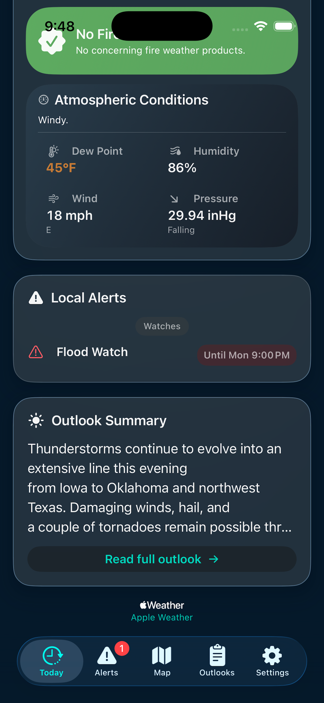
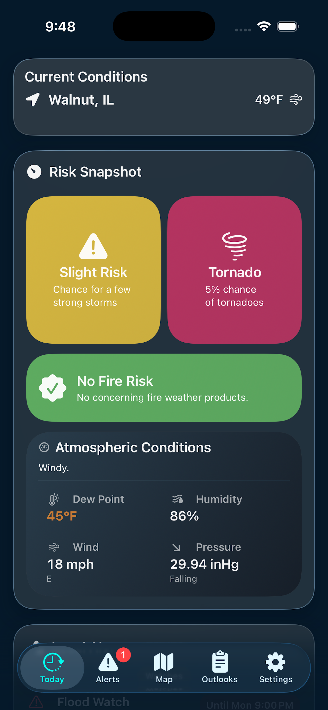
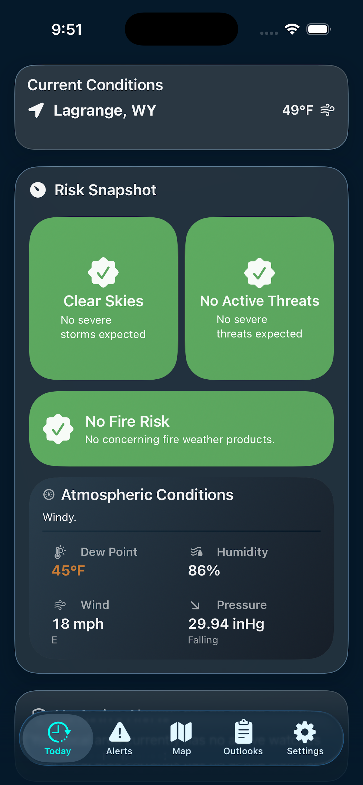
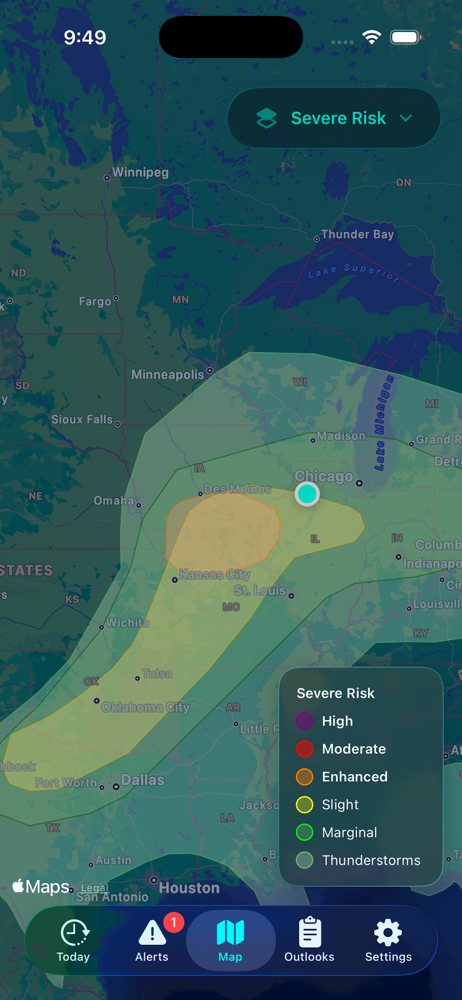
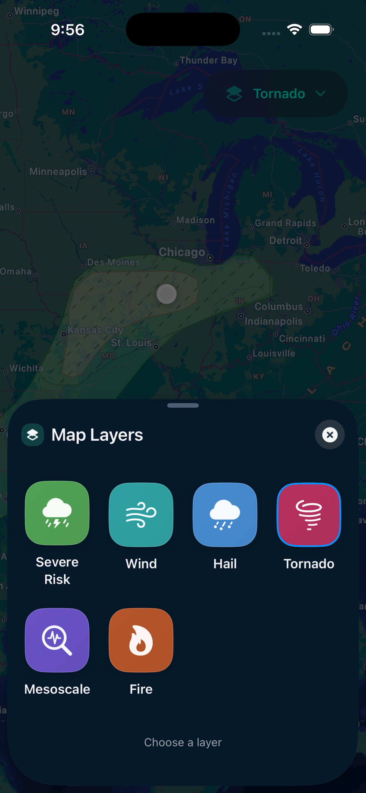
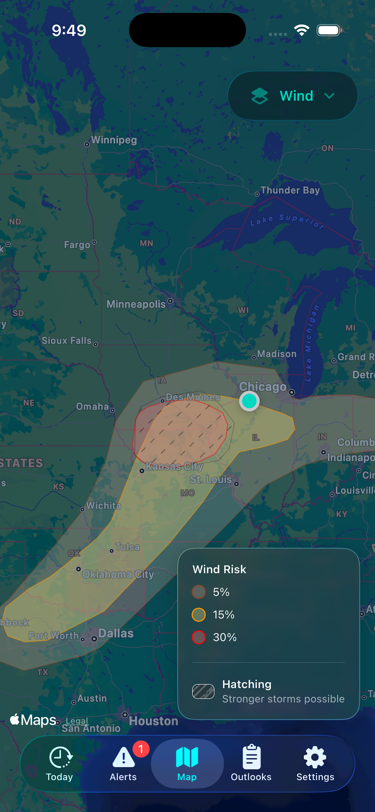
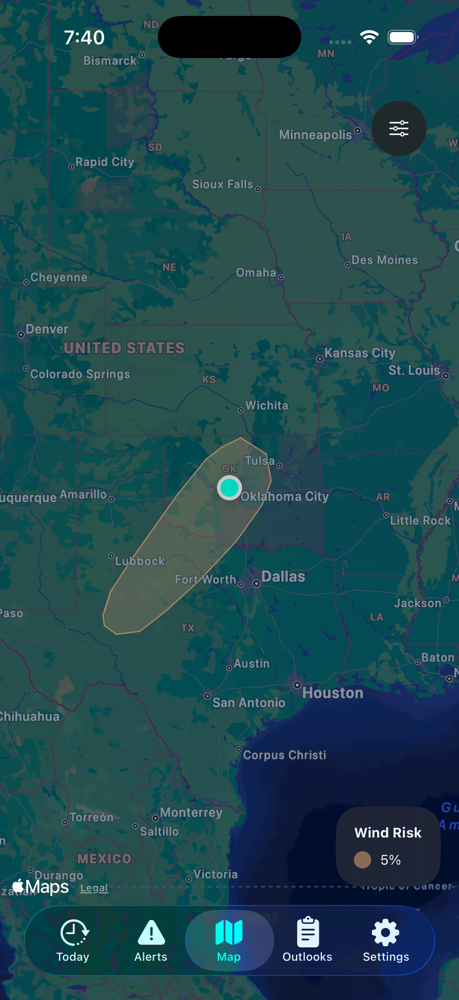
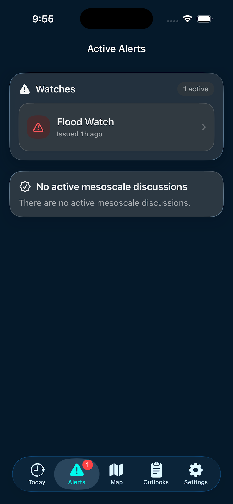
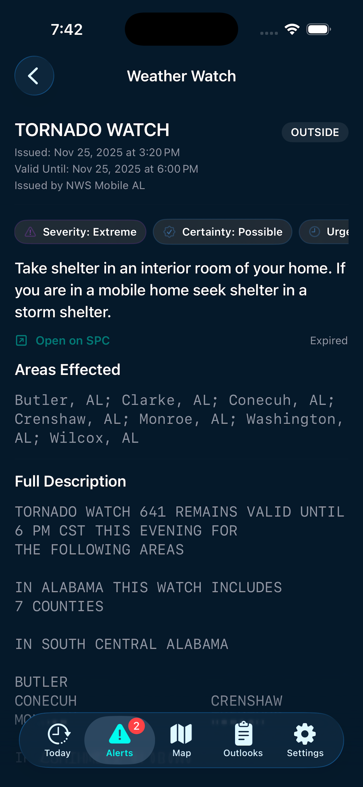

# SkyAware

SkyAware is a SwiftUI-first iOS app focused on hyper-local severe weather awareness. It combines NWS and SPC data sources to visualize current risks and deliver timely notifications. The repository is public, but this README is written primarily for internal development use.

## Key Features
- Visualize current severe weather risks for your location
- Get notified when a mesoscale discussion, watch, or warning is issued
- Morning severe weather risk summary
- Map layers for categorical and probabilistic severe risks (wind/hail/tornado) plus mesoscale overlays
- Background refresh with automatic data cleanup and cadence policies
- Localized risk queries driven by NWS gridpoint metadata (county/zone based watch lookup)
- In-app diagnostics, including a log viewer and background run health screen

## Screenshots
| Today + Alerts | Today + Risks | Today (Clear) |
|---|---|---|
|  |  |  |

| Map (Categorical Risk) | Map Layers | Wind Risk |
|---|---|---|
|  |  |  |

| Hail Risk | Active Alerts | Watch Detail |
|---|---|---|
|  |  |  |

## Getting Started
### Requirements
- Xcode 16+
- iOS 18+
- Swift 6+

### Open in Xcode
```sh
xed SkyAware
```

## Build & Run
```sh
xcodebuild -project SkyAware/SkyAware.xcodeproj -scheme SkyAware -destination "platform=iOS Simulator,name=iPhone 15" build
```

## Testing
```sh
xcodebuild -project SkyAware/SkyAware.xcodeproj -scheme SkyAware -destination "platform=iOS Simulator,name=iPhone 15" test
```

## Configuration
- App configuration lives in `SkyAware/Config`.
- Shared assets and previews live in `SkyAware/Resources`.
- The app uses NWS and SPC as primary data sources.
- Ensure location and notification permissions are enabled when testing.

## Architecture
- **App**: app entry points and dependency wiring.
- **Features**: SwiftUI screens and feature logic (e.g., Map, Summary, Diagnostics).
- **Providers**: data fetch and sync (NWS/SPC).
- **Repos**: persistence and query logic.
- **Utilities / Views**: shared helpers, extensions, and reusable UI.

Data flow is Provider → Repo → Feature View, with background refresh orchestrated by app lifecycle and cadence policies.

## Logging & Diagnostics
- Logging categories are centralized under `SkyAware/Sources/Utilities/Extensions/Logger+Extension.swift`.
- Diagnostics screens include the log viewer and background run health.
- All logging is treated as public for now; revisit if sensitive data is introduced.

## Contributing
- Commits follow the project convention: single-line, short, imperative summaries prefixed with `- `.
- PRs should describe intent, list user-visible changes, and note testing performed.
- Avoid committing secrets or credentials.

## Security & Privacy
- Keep private keys and WeatherKit credentials out of the repo.
- Do not log sensitive location or alert data in production code.

## Weather Awareness Disclaimer
SkyAware provides informational weather awareness only and does not issue official warnings. Always rely on official alerts from the National Weather Service and local authorities. See `EULA.md` for full terms.

## License
Use of SkyAware is governed by the End-User License Agreement in `EULA.md`.
