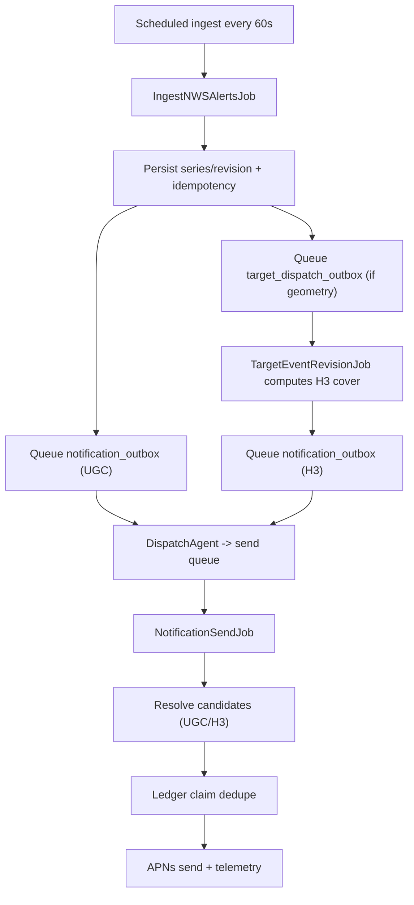

# Timely Notifications Strategy (Reconciled to Current Code)

## Scope
This document reconciles strategy intent with the currently implemented Arcus Signal backend flow in `~/Code/arcus-signal/Sources`.

Date reconciled: 2026-04-27

## Current Intent That Still Holds
- APNs is the primary mechanism for timely background delivery on iOS.
- Device presence is owned by backend APIs (not APNs).
- Fast ingest plus idempotent dispatch is preferred over client-only polling.
- Privacy-first handling of location targeting data remains a requirement.

## Current Implemented Flow (As Of Today)

### 1) Worker cadence and lanes
- Worker schedules ingest every 60 seconds via `DispatchIngestNWSAlertsScheduledJob`.
- Queue lanes in use: `ingest`, `target`, `send`.

### 2) Ingest and persistence
`IngestNWSAlertsJob`:
- Fetches NWS active alerts (or fixture replay).
- Maps payloads into canonical `ArcusEvent` models.
- Revision idempotency gate: skips if `revision_urn` already exists.
- Resolves/merges series via referenced URNs.
- Advances the series snapshot only when incoming `sent >= currentRevisionSent`.

### 3) Outbox enqueue behavior
For each persisted/advanced revision:
- Enqueues `notification_outbox` in `ugc` mode.
- Enqueues `target_dispatch_outbox` only when geometry exists.

### 4) Targeting prep (H3)
`TargetEventRevisionJob`:
- Converts polygon/multipolygon geometry to H3 cells (resolution 8).
- Stores/upserts H3 cover in `arcus_geolocation`.
- Enqueues `notification_outbox` in `h3` mode.
- If geometry is unsupported/missing (for H3), it records completion as unsupported and skips H3 enqueue.

### 5) Notification dispatch to send queue
`DispatchAgent.dispatchPendingNotificationJobs`:
- Selects `notification_outbox` rows where `state=ready`, `mode=<ugc|h3>`, `available_at <= now`.
- Dispatches `NotificationSendJob` onto `send` lane.
- Marks outbox row `state=done` after enqueue to send queue.

### 6) Candidate resolution and APNs send
`NotificationSendJob`:
- Loads series and ensures payload revision matches `currentRevisionUrn`; stale revision payloads no-op.
- Candidate selection:
  - `ugc` mode: match `device_presence` county/zone/fire_zone against series UGC codes.
  - `h3` mode: match `device_presence.h3_cell` against persisted series H3 cells.
- Per-device dedupe claim uses `notification_ledger` with unique key `(installation_id, series_id, revision_urn)`.
- Builds user-facing title/subtitle/body from series + reason + mode.
- Sends APNs using installation environment (`sandbox` vs `prod`) and records send outcome.
- Writes debug and attempt telemetry (`notification_debug`, `notification_send_attempts`).

### 7) Lifecycle cleanup
Ingest cleanup marks series:
- `active -> expired` when expiration windows pass.
- `active|expired -> ended` when `ends < now`.

## What Is Implemented vs Planned

### Implemented now
- End-to-end server-driven pipeline: ingest -> outbox -> targeting -> send.
- Dual targeting modes: UGC-first path and H3 path.
- Dedupe via DB uniqueness constraints.
- APNs environment-aware delivery.

### Planned / not current
- Field-level "meaningful change" gating (geometry/severity/urgency/certainty diff policy) is not currently enforced as a separate gate.
- All-clear and cancel notification dispatch (`endedAllClear`, `cancelInError`) exist in enums/content logic, but dispatch wiring is not currently present.
- Explicit policy matrix/cooldowns/rate shaping are not fully implemented as a standalone policy engine.
- Silent-push prefetch optimizations are not implemented.
- Critical Alerts entitlement path is not implemented.

## Practical Invariants In Current Code
- Revision idempotency: duplicate `revision_urn` is ignored.
- Notification outbox dedupe: unique `(series_id, revision_urn, mode)`.
- Notification ledger dedupe: unique `(installation_id, series_id, revision_urn)`.
- API process does not send APNs directly; delivery remains worker-owned.

## Current Risks / Follow-Ups (Code Findings, Not Doc Intent)
1. `notification_outbox` rows are marked `done` after enqueue to send queue, not after APNs success; operationally this is "dispatched" rather than "delivered".
2. APNs send failures update ledger status to `failed`, but there is no retry pipeline for failed sends yet.
3. Candidate freshness cutoffs are defined in code paths but currently invoked with `nil` (no freshness window).
4. H3 path currently no-ops when geolocation is missing; there is no fallback-to-UGC inside the H3 send path.
5. Ingest-driven enqueue behavior is based on revision/snapshot progression, not a dedicated semantic change classifier.

## Reconciled Architecture Summary

## Decision Guidance
- Use this document as the current-state baseline.
- Treat items in "Planned / not current" as roadmap intent, not implemented behavior.
- When code and docs conflict, code behavior is current truth unless superseded by a newer design decision.
