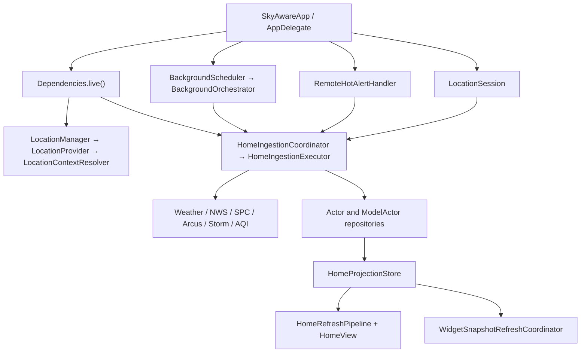
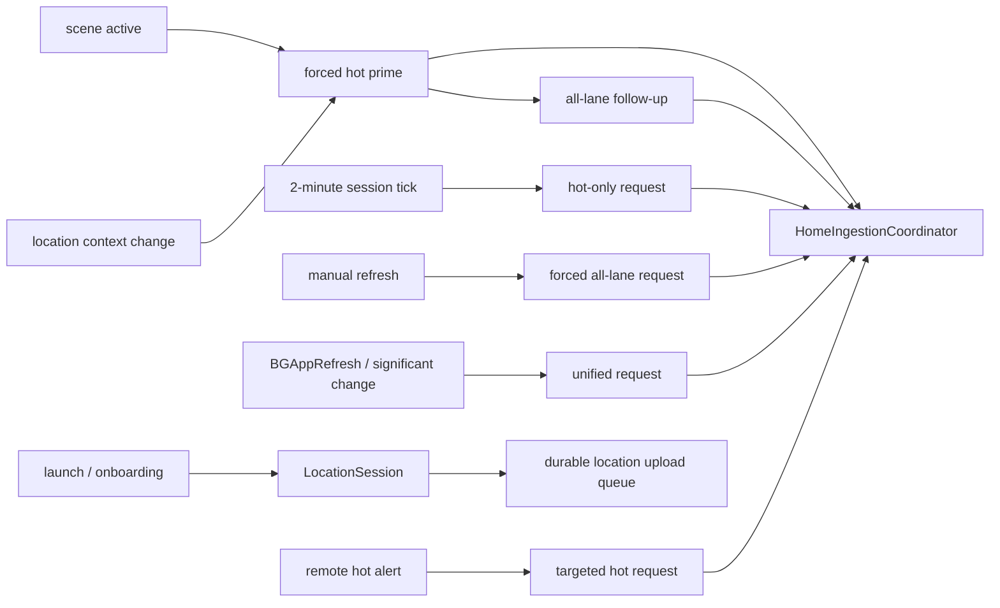
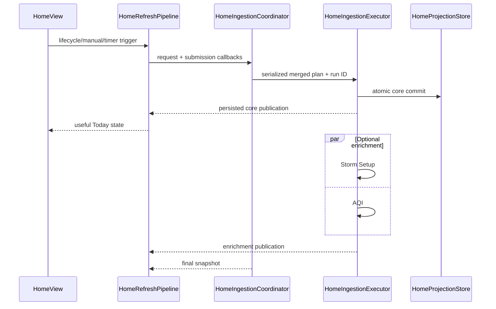

# Codebase Architecture Recovery

## 1. Executive assessment

SkyAware's current architecture is coherent and substantially intentional. It has evolved through six recognizable
generations from direct feature-owned refreshes to a location-scoped, cached-first system with unified ingestion,
atomic persistence, staged publication, durable uploads, remote-alert convergence, and conservative notification
semantics. The correct simplification strategy is therefore recovery and tightening, not replacement.

The strongest boundaries are manual composition, actor-isolated repositories, `LocationSession`, unified ingestion,
atomic SPC and Today commits, and explicit identity guards. Those boundaries protect real product invariants and
should remain.

The highest-leverage current defect class is **lossy absence semantics**. Two paths convert "unavailable or not
requested" into "authoritatively empty":

- a transient warning query failure can erase previously known warning overlays from a successfully refreshed map;
- a hot-only two-minute Today tick publishes `nil` AQI and clears useful same-location AQI.

The most serious lifecycle risk is cancellation rather than duplication: a canceled caller remains registered as a
`HomeIngestionCoordinator` waiter, while background upload draining occurs before the background cancellation
handler and may consume the task budget through retries.

Confidence terminology in this document:

- **High**: current source plus executed tests or direct build metadata.
- **Medium**: current source and tests exist, but the relevant runtime scenario was not observed.
- **Low**: historical or documentary evidence only.

This is an investigation at `main`; no implementation was performed.

## 2. Pinned source baseline

| Item | Recovered value |
| --- | --- |
| Repository | `justinrooks/project-arcus` |
| Branch | `main`, tracking `origin/main` |
| `HEAD` / `origin/main` | `0697e440689cada99d03a67e7aa935d87656803c` |
| Commit | `Improve Today refresh pipeline and stabilize presentation (#328)` |
| Commit date | 2026-07-22 12:40:11 -0600 |
| Initial state | Clean |
| Audit date | 2026-07-23 |

The supplied expected SHA and local/remote `main` were identical. Adjacent local ArcusCore and Arcus Signal working
trees contained unrelated user changes; they were inspected read-only.

## 3. Repository and build settings

| Concern | Current truth |
| --- | --- |
| Xcode project | `SkyAware.xcodeproj`, object version 77, last upgrade 2650 |
| Targets | `SkyAware`, `SkyAwareWidgetsExtension`, `SkyAwareTests`, `SkyAwareUITests` |
| Schemes | `SkyAware`, `Widgets` |
| Default SkyAware test plan | `Tests/SkyAware_Tests.xctestplan`; unit target enabled |
| All-tests plan | `Tests/SkyAware_All_Tests.xctestplan`; unit and UI targets enabled |
| Deployment target | iOS 18.5 in evaluated build settings |
| Swift | Swift language mode 6; strict concurrency `complete` |
| Default actor isolation | Not configured |
| App bundle | `com.skyaware.app` |
| Widget bundle | `com.skyaware.app.widgets` |
| Project version | app and widget `1.1.0 (80)` |
| ArcusCore | 0.4.4, revision `977945d87d6c54b6c4a861da3fc2d1cb66b0aaac` |
| SwiftyH3 | 0.5.0, revision `6d9b5774cc7cc198597b14aaccf213587947678c` |
| Audit toolchain | Xcode 26.6 / Swift driver 6.3.3 / iOS 26.5 simulator SDK |

The app uses approximately 41,126 production Swift lines and 34,292 test Swift lines. File length was not used to
rank findings.

## 4. Architecture-generation timeline

| Generation | Period and anchors | Architecture introduced | Current classification |
| --- | --- | --- | --- |
| G0: feature-owned | Jul-Oct 2025 | SwiftUI features called providers/repos directly; local NWS/SPC persistence and ad hoc background work | Intentionally superseded; fragments remain only where feature-local behavior is appropriate |
| G1: explicit Today state | Dec 2025-Jan 2026, PR #55 | DTO-backed Home state, clearer summary and alert presentation ownership | Foundation absorbed by later projection model |
| G2: resolved location and Arcus | Mar-Apr 2026, PRs #86, #97, #104 | snapshot/network hardening, Arcus alert consumption, `LocationContext`, early Home pipeline | Current location lineage; early refresh layers superseded |
| G3: unified ingestion | Apr-May 2026, PRs #130, #140, #151, #166, #173 | unified ingestion, Home projections, map feature model, widget snapshot, alert identity cleanup | Current architectural backbone |
| G4: durable and atomic | May-Jun 2026, PRs #193, #202, #212, #215, #246, #260 | upload durability, Today truth recovery, atomic SPC batches, invalidation controls, native UI, cached startup | Current reliability boundary |
| G5: enrichment and staged publication | Jul 2026, PRs #303, #304, #313-#317, #328 | Storm Setup/AQI, repository organization, notification cadence/coalescing, polygon holes, staged Today core/enrichment | Current generation |

This timeline reconciles merged PRs #55, #86, #97, #104, #130, #140, #151, #166, #173, #193, #202, #212,
#215, #246, #260, #303, #304, #313, #314, #315, #317, and #328. The organization, Today state-flow, Today
performance, Map, notification, location-hardening, and Storm Setup campaigns are completed historical campaigns,
not new roadmap themes.

### Generation recovery detail

#### G0 — Feature-owned refresh

- **Problem/ownership:** establish useful weather, NWS, and SPC feature paths; views/features owned refresh timing and
  provider calls.
- **Identity/persistence:** provider-native IDs and local source rows; no canonical location projection or unified
  run identity.
- **Replacement/compatibility:** G2-G3 replaced cross-feature refresh ownership. Direct feature calls survive only
  for genuinely feature-local operations such as manual outlook refresh.
- **Tests/evidence:** early parser/provider/repository tests survive; later orchestration tests describe the
  replacement.
- **Current/removed/renamed concepts:** source repositories remain; ad hoc Home/background convergence was removed.
  "Refresh" survived as a name but now means submitting a plan rather than directly fetching each source.

#### G1 — Explicit Today state

- **Problem/ownership:** PR #55 moved Summary away from implicit view-derived DTO state toward an explicit Home-owned
  presentation baseline.
- **Identity/persistence:** alert/presentation DTO identities became visible; durable location projection was not yet
  the owner.
- **Replacement/compatibility:** G3 projection/pipeline publication absorbed the Home-owned state. DTO presentation
  mappers remain where they are still the correct UI boundary.
- **Tests/evidence:** Summary/Home state and presentation suites preserve the behavior.
- **Current/removed/renamed concepts:** explicit Summary states remain; the original monolithic owner was removed.
  "Home state" now spans durable projection and visible submission rather than one value.

#### G2 — Resolved location and Arcus alerts

- **Problem/ownership:** PRs #86, #97, and #104 addressed network/snapshot reliability, moved alerts to Arcus, and
  made resolved location an input to Home refresh.
- **Identity/persistence:** accepted location snapshot, H3/NWS context, refresh key, Arcus series/revision identity,
  and early pipeline lifetime appeared.
- **Replacement/compatibility:** unified ingestion later replaced pipeline-owned provider orchestration. APNs and
  location-source aliases remain as bounded compatibility.
- **Tests/evidence:** location manager/provider/resolver, alert DTO/repo, and pipeline tests.
- **Current/removed/renamed concepts:** `LocationContext`, Arcus alert identity, and pipeline presentation ownership
  remain; earlier independent NWS/Arcus refresh paths were removed. The pipeline name survived after execution moved
  to coordinator/executor.

#### G3 — Unified ingestion and projections

- **Problem/ownership:** PRs #130, #140, #151, #166, and #173 converged lifecycle requests, introduced durable
  location-scoped Today truth, isolated map planning, derived widgets, and cleaned alert lifecycles.
- **Identity/persistence:** coordinator plan/run, projection key/readiness, map render plan, widget snapshot, and
  stable alert-series identity became explicit.
- **Replacement/compatibility:** one coordinator replaced independent foreground/background/remote runs; projections
  replaced transient-only Today truth. Targeted update APIs and payload aliases remain where needed.
- **Tests/evidence:** coordinator, projection, map model, widget, alert cleanup, and lifecycle suites.
- **Current/removed/renamed concepts:** all primary boundaries remain. Individual projection slice updates survived
  even after atomic core commit changed their original role.

#### G4 — Durable uploads and atomic state

- **Problem/ownership:** PRs #193, #202, #212, #215, #246, and #260 hardened upload delivery, restored Today truth,
  made accepted SPC batches atomic, reduced invalidation, modernized UI, and guaranteed cached startup.
- **Identity/persistence:** durable upload semantic identity, accepted SPC domain/window, risk-profile baseline, and
  explicit cached readiness were strengthened.
- **Replacement/compatibility:** queued coalescing replaced fire-and-forget upload; accepted/rejected transaction
  semantics replaced partial SPC mutation. Legacy location-source retry and projection migration remain bounded.
- **Tests/evidence:** pusher/uploader, Home state, SPC failure-injection, invalidation, adaptive UI, and cached-launch
  suites.
- **Current/removed/renamed concepts:** reliability boundaries remain. Default protocol fallbacks still expose some
  pre-atomic/pre-durable semantics (F-05/F-06).

#### G5 — Optional enrichment and staged publication

- **Problem/ownership:** PRs #303, #304, #313-#317, and #328 added Storm/AQI, clarified source organization,
  notification delta/cadence, polygon topology, and fast core-before-enrichment Today publication.
- **Identity/persistence:** Storm H3/freshness/cache identity, risk-change delta/coalescing identity, staged
  submission/run/refresh-key publication, and polygon rings were locked.
- **Replacement/compatibility:** staged publications replaced wait-for-everything completion; aggregate Storm
  response replaced older pieces. Atmospheric Conditions remains intentional fallback; optional enrichment still
  carries a lossy AQI absence from the initial G5 implementation (F-02).
- **Tests/evidence:** Storm/AQI, notification, polygon, Today stage/identity, and performance gate suites.
- **Current/removed/renamed concepts:** the full generation is current. Campaign top-level documentation did not
  consistently advance with its detailed ledger, creating documentation-only complexity.

## 5. Product and release invariant ledger

| Invariant | Current owner | Executed proof / product evidence | Failure mode | Change policy |
| --- | --- | --- | --- | --- |
| Cached-first Today | `HomeProjectionStore`, `HomeView` | `HomeViewProjectionLaunchTests`, `HomeRefreshPipelineTests`; v1.1 notes | Blank or cross-location launch | Locked |
| Resolve-forward refresh | `LocationSession`, `LocationContextResolver`, pipeline | location and pipeline suites | Refreshes stale location scope | Locked |
| Preserve useful stale content on partial failure | executor, projection, pipeline | pipeline/Storm suites | Known safety context disappears | Locked; two gaps F-01/F-02 |
| Location-scoped ownership | refresh/projection keys | context/projection tests | Cross-location publication | Locked |
| Authoritative-empty alerts | hot-lane outcome and atomic commit | `HomeProjectionStoreTests` | Stale alerts survive a confirmed empty response | Locked |
| Alert update/revision semantics | ArcusCore payload, `AlertRepo` | payload/repo/remote suites | Duplicate or stale revision presentation | Locked |
| Foreground/background/remote convergence | `HomeIngestionCoordinator` | coordinator, background, remote suites | Divergent truth or duplicate work | Locked |
| Hot-alert priority | ingestion plan/coordinator | coordinator and pipeline suites | Remote warning waits behind slow work | Locked |
| Atomic accepted SPC persistence | `SpcMapBatchPersistenceRepo` | `SpcProviderSyncMapProductsTests` | Mixed issuance or partial accepted state | Locked |
| Local Alerts outer identity | Summary section plan | Today campaign tests | Row/scroll churn | Locked |
| Storm Setup slot identity | Summary slot state | Summary/Storm tests | Section replacement/scroll jump | Locked |
| Core before optional enrichment | executor/pipeline publication | `StormSetupIngestionTests` | Slow optional service blocks useful Today | Locked |
| Storm cache expiration/backoff | Storm ingestion policy/repo | Storm policy/ingestion suites | Expired or older guidance wins | Locked |
| Risk-change coalescing | background notification engine | cadence/risk tests | Duplicate or suppressed notifications | Locked |
| 20/40/60 cadence | `BackgroundOrchestrator` | cadence tests; release notes | Wrong energy/safety tradeoff | Locked |
| Widget freshness | snapshot builder/store/formatter | widget suites | Widget claims stale data is current | Locked |
| Polygon interior rings | polygon mapper/repositories | polygon/risk tests; PR #317 | Users inside holes are shown at risk | Locked |
| Conservative notification positioning | notification engines and alert policy | notification suites; North Star/release docs | Over-alerting or missed high-value signal | Locked |

## 6. Current composition map

`Dependencies.live()` is large primarily because composition is explicit. That is honest complexity. Its environment
fallbacks fail fast, so missing live dependencies are developer errors rather than silently degraded production.
F-09 identifies only an internally contradictory Arcus base-URL compatibility branch.

## 7. Lifecycle trigger graph

Equivalent work converges at the coordinator. It serializes one active plan, absorbs compatible requests, and merges
one pending follow-up. Deduplication is deliberate; caller cancellation is the unresolved ownership hole.

## 8. Vertical-flow diagrams and ledgers

### 8.1 Application composition and lifecycle

- **Entry/triggers/types:** `SkyAwareApp`, app delegate callbacks, scene phase, background task registration,
  activation cleanup, remote registration, `LocationSession`, and `HomeView`.
- **Owner/state/isolation:** `SkyAwareApp` owns composition and lifecycle routing on the main actor; actors own service
  state. Environment accessors intentionally fail fast when unconfigured.
- **Tasks/cancellation/supersession:** launch, activation, token/upload, and scheduler tasks are unstructured roots
  anchored to lifecycle callbacks; downstream coordinator joining suppresses equivalent ingestion. Scene-owned Home
  timer tasks are canceled when inactive.
- **I/O/transformation/consumers:** constructs repositories/providers, restores SwiftData, registers APNs/background
  work, and publishes dependencies to views.
- **Errors/retry/stale/empty:** composition errors are fatal; runtime registration/upload failures are logged and
  retried by their owners. No content-empty semantics originate here.
- **Proof/history/questions:** activation cleanup, registration, pipeline, background, and remote tests; G3-G5.
  Runtime termination/background delivery remains device-only.

### 8.2 Location resolution and ownership

- **Entry/triggers/types:** Core Location stream, one-shot requests, persisted restoration, `LocationManager`,
  `LocationProvider`, `LocationContextResolver`, `LocationSession`.
- **Owner/state/isolation:** manager (`@MainActor`) owns raw authorization/location delivery; provider actor owns the
  accepted snapshot, geocode/H3 cache, and restoration; resolver actor owns context construction; session
  (`@MainActor`) owns UI-facing authorization, current snapshot/context, and publication.
- **Tasks/cancellation/supersession:** session cancels superseded context tasks; timestamp/H3 guards reject stale
  geocodes/context. Individual one-shot location waiters time out but do not promptly remove themselves on caller
  cancellation.
- **I/O/transformation/consumers:** Core Location → accepted snapshot → placemark/H3 → NWS grid/county/fire zone →
  refresh key; snapshots and upload queue persist. Today/background/widgets consume resolved context.
- **Errors/retry/stale/empty:** cached snapshot/placemark may bridge transient failure; authorization is explicit.
  H3 fallback preserves last useful identity. No authoritative empty location exists.
- **Proof/history/questions:** `LocationManagerTests`, `LocationProviderTests`, `LocationContextResolverTests`,
  `LocationSessionTests`; G2-G5. Physical significant-change delivery is unverified here.

### 8.3 Today foreground refresh

- **Owner/state/isolation:** pipeline (`@MainActor`) owns visible submission state; coordinator/executor actors own
  run serialization/orchestration; `HomeProjectionStore` (`@ModelActor`) owns durable projection truth; Home maps
  pipeline stages plus `@Query` cache to presentation.
- **Tasks/cancellation/supersession:** pipeline creates scene/timer/refresh roots; executor provider lanes use
  structured concurrency. Submission ID, run ID, and refresh key independently reject stale publications.
  Coordinator waiters are not cancellation-aware (F-03).
- **Network/persistence:** Weather, Arcus alerts, SPC/NWS, Storm, AQI; projection and source repos read/write; core
  commit precedes optional enrichment; widgets refresh from persisted projection.
- **Errors/retry/stale/empty:** individual provider policies degrade to cached/skipped/failed outcomes; confirmed
  empty alerts clear. AQI collapses skip/failure to `nil` at publication (F-02).
- **Proof/history/questions:** coordinator, executor/Storm, pipeline, projection, and Home state suites all executed;
  G3-G5. Cached-first arbitration needs physical-device visual/performance evidence.

### 8.4 Today identity and supersession

| Identity | Creator/comparer/lifetime | Protection and overlap | Removal regression |
| --- | --- | --- | --- |
| Submission ID | pipeline; pipeline callbacks; one visible submission | User-visible request; overlaps run when joined | Older UI request publishes |
| Coordinator run ID | coordinator; publication bridge; one execution | Staged publications from exact executor run | Cross-run stage acceptance |
| Location refresh key | resolver; pipeline/Home; until context changes | H3/NWS/quantized location scope | Cross-location display |
| Projection key | projection model; store/Home/widget; persisted | Durable location partition | Cached data mixes locations |
| Provider freshness identity | issuance/sent/loaded timestamps; provider/repo | Monotonic source truth | Older response overwrites newer |
| Alert series ID | Arcus series UUID; repo/UI | Stable event identity | Duplicated alert rows |
| Alert revision ID | message ID plus `sent`; repo/remote | New content within a series | Stale update treated as current |
| SwiftUI row/slot ID | section/item plan; SwiftUI | Structural stability | scroll/animation churn |
| Map render-plan ID | planner; model/cache | Layer and data-generation scene reuse | stale or needless reconstruction |
| Widget snapshot identity | projection/source timestamps; store/formatter | freshness of derived cross-process value | stale widget claims currency |

These identities have different lifetimes and must not be collapsed into one UUID. A small explicit
`HomeVisiblePublicationIdentity` could group submission/run/refresh key for readability only after characterization;
it must preserve all three comparisons.

### 8.5 Projection persistence and readiness

- **Entry/owner:** executor commits, enrichment updates, Home/widget reads; `HomeProjectionStore` is the authoritative
  SwiftData actor. Display readiness requires a committed core baseline, not every optional slice.
- **State/tasks/supersession:** projection key partitions state; one model-actor transaction implements
  `commitCore`; individual updates support enrichment and targeted behavior.
- **Errors/stale/empty:** optional `HomeProjectionCoreCommit` fields mean skipped; present empty alerts mean
  authoritative empty. Legacy records migrate without Storm cache. Store errors propagate to orchestration.
- **Proof/history:** `HomeProjectionStoreTests` executed; G3-G5.
- **Risk:** the protocol default implements `commitCore` as up to three independent operations and lets a fake claim
  conformance without production atomicity (F-05).

### 8.6 Background refresh and notifications

- **Entry/types:** BG task → `BackgroundOrchestrator`; upload drainer, global SPC sync, context resolution, unified
  ingestion, morning/meso/risk engines, coalescing, health, next schedule.
- **Owner/isolation:** orchestrator actor owns sequence; engines/repositories own notification state; scheduler owns
  replacement policy.
- **Tasks/cancellation:** upload drain currently precedes the cancellation handler; ingestion waits through the
  coordinator. Subsequent checks exist, but coordinator waiters do not cancel promptly. Retry delays of 0/5/15
  seconds per queued upload can spend the budget (F-03/F-04).
- **Policy:** current tests intentionally require drain-before-ingestion and drain-on-early-exit. PR #303 first moved
  draining after successful ingestion; review follow-up `079b8e…` moved it to the beginning so pending uploads are
  attempted even on early exit. The July performance audit describes the intermediate, now-stale ordering.
- **Errors/stale/empty:** useful snapshot drives conservative notifications; failed location prevents
  location-dependent work; health/cadence record 20/40/60 recovery/threat/all-clear paths.
- **Proof/history/questions:** background, notification, cadence, upload tests executed; G4-G5. OS expiration,
  actual APNs scheduling, and accumulated backlog latency require a device.

### 8.7 Background location change

- **Entry/types:** significant-change callback → `BackgroundLocationChangeHandler` → resolver → unified ingestion →
  watch/risk engines; location snapshot enqueues durable upload.
- **Owner/tasks:** handler actor owns one active task and joins duplicate receipts; coordinator absorbs or queues work
  against foreground/background runs. The root is unstructured because the OS callback defines the lifetime.
- **Errors/supersession:** newest accepted context wins; unavailable location preserves prior useful data; notification
  engines remain conservative. Caller cancellation does not propagate through a joined coordinator waiter.
- **Proof/history/questions:** location, pipeline, coordinator, and notification tests; G3-G5. Real significant-change
  and foreground race not observed on device.

### 8.8 Remote hot-alert handling

- **Entry/types:** AppDelegate APNs receipt/open → ArcusCore payload decode → `RemoteHotAlertHandler` → targeted
  coordinator request → projection/widget refresh and alert focus.
- **Owner/state:** Arcus series UUID is canonical alert identity; message ID / revision-sent timestamp is the revision
  boundary. Handler actor owns request handling; coordinator owns absorption/follow-up.
- **Tasks/cancellation:** AppDelegate bridges completion with a task; targeted work joins only a remote-aware active
  hot lane that has not completed, otherwise it queues. Completion reports new/no-data/failed.
- **Compatibility/errors:** canonical `arcusAlertId` and `revisionSent` are preferred; documented legacy aliases are
  decoded. Widget fallback reads the latest projection when targeted context is absent.
- **Proof/history/questions:** payload, remote handler, repo, widget-driver suites executed; G3-G5. Terminated launch,
  APNs deadline, and tap-focus presentation require device/system delivery.

### 8.9 Map data and rendering

- **Entry/types:** view/layer changes → `MapFeatureModel.reload` → actor repos → `MapFeaturePlanner` → render plan →
  materialized/cached scene → MapKit reconciliation.
- **Owner/state:** SPC repos own accepted source state; model (`@MainActor`) owns selected layer, fetch outcomes,
  plans, scenes, warm-scene task; MapKit view owns final overlay reconciliation.
- **Tasks/cancellation/supersession:** five structured async fetches; plan identity gates scene reuse; warming is a
  cancelable task. SPC staging caps concurrency and commits convective/fire domains atomically with rollback.
- **Errors/stale/empty:** thematic outcomes distinguish accepted/empty/unavailable and preserve stale content.
  Warning query failure is instead converted to `[]`, so a successful thematic fetch can erase cached warnings
  (F-01). Confirmed empty and unavailable are therefore conflated only at this edge.
- **Proof/history/questions:** map model, warnings, scene, freshness, SPC batch, and polygon tests executed; G3-G5.
  Scene-warming benefit and actual map reconciliation cost lack current traces.

### 8.10 Storm Setup and AQI

- **Entry/types:** weather-lane plan + preferences → eligibility/policy → Arcus clients → optional structured children
  → Storm persistence/AQI value → enrichment publication → Summary/detail/fallback presentation.
- **Owner/state:** SkyAware owns eligibility, timeouts, cache/backoff, H3 guard, persistence, and presentation;
  ArcusCore owns wire responses; Arcus Signal owns endpoints and service freshness. Storm persistence accepts only
  newer same-H3 responses; AQI is not persisted.
- **Tasks/cancellation:** optional children run concurrently and observe parent cancellation. Foreground has a Storm
  timeout; background/session failures use backoff. Core publication never waits for them.
- **Errors/stale/empty:** Storm explicitly preserves fresh cache and rejects expired/mismatched/older data. AQI client
  maps server error or skipped lane to `nil`; pipeline treats that as a clearing value (F-02). Atmospheric Conditions
  remains the fallback when Storm Setup is disabled/unavailable.
- **Proof/history/questions:** Storm/AQI clients, policy, ingestion, Summary/detail suites executed; G5. Arcus Signal's
  current endpoint returns a value or 503, not an authoritative null.

### 8.11 Widgets

- **Entry/types:** projection commit, location/risk change, or APNs → snapshot coordinator/builder → atomic app-group
  JSON write → WidgetKit timeline/rendering → route URL.
- **Owner/state:** Today projection remains canonical; widget snapshot is a privacy-safe derived read model with its
  own generation/freshness timestamp because it crosses process boundaries.
- **Tasks/errors:** writes are atomic; missing/corrupt snapshots render unavailable, stale timestamps are labeled,
  and passive refresh is about 15 minutes. Risk/location changes reload all kinds; alert changes reload the combined
  kind.
- **Proof/history/questions:** widget builder/store/formatter/coordinator/route suites executed; G3-G5. Real extension
  scheduling and deep-link handoff were not observed.

### 8.12 Release, CI, and validation workflow

- **Entry/types:** Xcode scheme/plans, SPM resolution, build settings, release docs/tags, `tools/ci` archive-note
  script, `.xcresult`, historical Instruments artifacts.
- **Owner/state:** the project owns build metadata; release docs/tags claim distribution versions; CI generates
  TestFlight text from recent commits. No in-repo mechanism proves how tag build 94 maps to committed build 80.
- **Tasks/errors:** default plan runs units; the all-tests plan includes UI. A substantive UI smoke was executed
  through the active scheme/all-tests plan. Release docs are manually generated and have drifted (F-10).
- **Proof/history/questions:** Debug build, 303 focused tests, 888 full unit tests, and UI smoke all passed and all
  result bundles were inspected. No Release build/archive or current physical-device trace was run.

### Per-flow documentation, runtime evidence, and open questions

| Flow | Primary documentation/history | Runtime evidence in this audit | Unresolved question |
| --- | --- | --- | --- |
| Composition/lifecycle | app summary, release readiness, PRs #130/#304 | Debug build and activation/registration tests | Terminated/background lifecycle on device |
| Location | app summary, location-hardening history, PRs #86/#104/#193 | deterministic location/context tests | Real significant-change delivery and one-shot cancellation |
| Today foreground | Today state/performance runbooks, PRs #202/#260/#328 | deterministic unit gates and UI navigation smoke | Comparable Release-device visual/performance scenarios |
| Identity/supersession | Today state/performance ledgers, PRs #173/#303/#328 | stage/key/identity tests | Whether grouping names improves comprehension without merging guards |
| Projection | Today state runbook, PRs #130/#202/#328 | model-actor store/failure tests | Which individual mutation methods remain truly necessary |
| Background/notifications | release notes, weekly audit, PRs #313-#315 | cadence/coalescing/upload-order tests | BG expiration and backlog budget on device |
| Background location | app summary and location campaign history | handler/context/coordinator policy tests | Foreground race under real significant-change receipt |
| Remote alerts | release notes, PRs #97/#151/#173 | payload/handler/repo/widget tests | APNs deadline and terminated-open behavior |
| Map | North Star, app summary, PRs #140/#212/#317 | model/planner/SPC/polygon tests | Scene-warming value and MapKit cost |
| Storm/AQI | release/TestFlight notes, PR #303 | policy/client/ingestion/presentation tests | Deployed server revision and AQI retention gap |
| Widgets | release docs, PR #166 | store/builder/freshness/route tests | WidgetKit scheduling and real deep-link handoff |
| Release/CI | release docs, tags, test plans, CI script | all plans proved runnable; all result bundles inspected | Build-94 provenance and current Release traces |

## 9. State-ownership map

| State | Authoritative owner | Read models / consumers | Classification |
| --- | --- | --- | --- |
| Raw location and authorization | `LocationManager` | provider/session | Essential platform boundary |
| Accepted snapshot/geocode/H3 | `LocationProvider` actor | resolver/upload | Essential ownership boundary |
| Resolved context/refresh key | resolver; session publishes | ingestion/Home | Essential policy boundary |
| In-flight ingestion plans/waiters | coordinator actor | lifecycle callers | Essential concurrency boundary; waiter lifecycle gap |
| Durable Today projection | `HomeProjectionStore` | Home/widgets/notifications | Essential persistence boundary |
| Visible Today submission state | pipeline main actor | HomeView | Presentation boundary |
| Alert/source rows | actor/ModelActor repos | projections/map/notifications | Essential persistence boundary |
| Map render state | `MapFeatureModel` main actor | map view | Presentation boundary |
| Notification pending/coalescing state | notification repos/engines | orchestrator | Essential policy boundary |
| Widget JSON | widget snapshot store | extension | Cross-process presentation boundary |

`HomeView` deliberately arbitrates persisted `@Query` data and staged pipeline state per slice. That preserves
cached-first presentation but spreads the final selection policy across computed properties (F-07).

## 10. Identity and supersession map

The detailed Today identity table is in §8.4. System-wide supersession follows four rules:

1. **Location:** a refresh/projection key prevents cross-location publication.
2. **Execution:** plan satisfaction and run ID determine which coordinator execution may serve a waiter.
3. **Source:** provider issuance/revision timestamps reject older source truth.
4. **Presentation:** stable semantic IDs preserve SwiftUI/Map/widget structure while generation timestamps change.

These are orthogonal. Simplification may name their relationship, but must not consolidate them without proving the
four rules independently.

## 11. Actor and task-ownership map

| Boundary | Isolation | Task structure | Cancellation owner | Finding |
| --- | --- | --- | --- | --- |
| App/UI/location session/pipeline/map | `@MainActor` | lifecycle-root tasks plus cancelable scene/model tasks | lifecycle owner | Sound |
| Location provider/resolver/pusher | actors | structured calls; pusher retry loop | provider/pusher | One-shot waiter cancellation is a watchlist |
| Ingestion coordinator/executor | actors | coordinator creates execution and observer tasks; executor children structured | coordinator, but caller waiters have none | F-03 |
| SwiftData repositories | `@ModelActor`/actors | caller-structured | caller | Sound; F-05 protocol mismatch |
| Background orchestrator | actor | OS-root task plus structured sequence | background handler after pre-drain | F-04 |
| Notification engines | actors/value policy | caller-structured | orchestrator | Sound |
| Widget store | actor/value transformations | caller-structured | caller | Sound |

No evidence supports `Task.detached`, unchecked sendability, or a new global task layer.

## 12. Persistence and readiness map

| Store | Key / readiness | Write semantics | Empty/stale semantics |
| --- | --- | --- | --- |
| Home projection | location projection key; core-committed flag | atomic production core commit, targeted enrichment updates | skipped slices preserve; present empty alerts clear |
| SPC map products | product window/domain identity | staged validation, accepted-domain atomic replace/rollback | accepted all-clear clears; rejected/unavailable preserves |
| Alerts | series/revision identity plus lifecycle | reconcile server revisions, terminal/expiry cleanup | successful collection and lifecycle rules govern removal |
| Storm Setup | H3 plus server freshness/expiry | persist only same-H3 newer response | fresh cache bridges failure; expired does not |
| Location upload queue | semantic payload key | durable coalescing and retry | missing token preserves queued work |
| Widget snapshot | one derived current snapshot | atomic JSON replacement | missing/corrupt unavailable; old snapshot labeled stale |

## 13. Network and external-contract map

| Boundary | Authority / pin | App adapter | Compatibility and proof | Dependency |
| --- | --- | --- | --- | --- |
| Alert collection/revision | ArcusCore 0.4.4 `DeviceAlertPayload`; Arcus Signal `/api/v2/alerts` at inspected `139f10…` | `ArcusClient`, `AlertRepo` | legacy DTO decoding tests; series UUID + revision sent | No current drift |
| Hot-alert APNs | ArcusCore `HotAlertAPNsPayload` | remote handler | canonical keys plus aliases; payload/handler tests | Retire aliases only with telemetry/server proof |
| Location upload/source | ArcusCore `LocationSnapshotPushPayload` and source enum; Arcus Signal location endpoint | HTTP uploader/pusher | legacy-source fallback only for 400/422; uploader tests | Coordinated retirement |
| Device preferences | ArcusCore preference payload; Arcus Signal preference endpoint | HTTP preference uploader | production live wiring; default no-op compatibility path | F-06 app-first hardening |
| Storm current | ArcusCore `StormSetupCurrentResponse`; Arcus Signal current endpoint | Storm client/ingestion | H3/freshness tests | No change required for current roadmap |
| AQI current | ArcusCore AQI response; Arcus Signal returns response or 503 | AQI client/executor/pipeline | optional app mapping conflates failure/skip; tests stop before retention | F-02 app work; contract can later become nonoptional |

ArcusCore and Arcus Signal were inspected only at consumed boundaries. Local ArcusCore matched the exact pinned
revision. The inspected Arcus Signal `main` is contract evidence, not proof of deployed production state.

## 14. SwiftUI observation and invalidation map

- `LocationSession`, `HomeRefreshPipeline`, and `MapFeatureModel` are main-actor observable owners.
- `HomeView` observes both pipeline state and unbounded projection/outlook `@Query` collections, then selects a
  location-matching projection and arbitrates individual slices.
- Stable Local Alerts and Storm Setup section/row identities are explicitly protected and tested.
- PR #328 narrowed staged publication and header observation; the completed performance campaign already covers
  projection coherence, stale-run rejection, provider overlap, optional-enrichment overlap, and structural identity.
- The remaining current performance question is not another source micro-optimization. It is comparable Release
  device evidence and, if that shows invalidation cost, whether a pure canonical presentation selector can narrow
  observation without changing ownership.

## 15. Test and validation-provenance map

| Evidence | This audit |
| --- | --- |
| Tests exist | 73 unit-test files and substantive UI tests inspected |
| Focused tests executed | 303 passed, 0 failed/skipped |
| Full unit target executed | 888 passed, 0 failed/skipped |
| UI test plan executed | `testTabNavigationLoadsEachPrimaryView` passed |
| `.xcresult` inspected | Debug build, focused, full unit, and UI smoke bundles |
| Debug build | Passed, 0 errors/warnings in build summary |
| Release build/archive | Not run |
| Simulator rendering | UI smoke exercised navigation; no screenshot-based visual review |
| Physical device | Not run |
| Instruments | Historical traces exist; no new trace |
| Comparable before/after metrics | Absent |

The test target emits three existing compiler warnings: inferred `Void?` in
`RemoteNotificationRegistrarTests`, an always-failing `#expect(false)` diagnostic in `MesoNotificationTests`, and
main-actor isolation diagnostics in `WidgetRouteURLTests`. They did not fail this build and are validation hygiene,
not architectural evidence.

## 16. Release and documentation consistency findings

Priority correction order:

1. Establish one release-truth procedure that reconciles project version, tag, distribution build, and the three
   release documents. Tags/release docs lead with `1.1.0 (94)`, while both the tagged project and current `main`
   report build 80. The archive script generates notes but does not prove build-number mutation.
2. Add post-release work, including PR #328, to `Unreleased`; it is currently empty.
3. Rewrite `docs/codebase/skyaware-app-summary.md` from current G5 truth. It still describes SwiftyH3 as the only
   package, UI tests as templates, refresh/loading and freshness ownership from earlier generations, and incomplete
   remote/map behavior now contradicted by source/tests.
4. Reconcile runbook headers and top-level ledgers with detailed entries. The organization runbook says `Planned`
   despite COM-01-COM-14 completion; Today state-flow top status says planned/incomplete despite its detailed ledger;
   Today performance top status remains planned while most implementation is merged.
5. Correct the July performance audit statement that upload draining occurs after core ingestion; current code and
   tests intentionally require pre-ingestion draining after review feedback.
6. Preserve historical audit outcomes as history. Do not rewrite resolved findings into current defects.

Release notes were not found to promise removed product behavior. The more important defect is omission and
ambiguous build provenance: important G5 behavior is not consistently represented, and the repository has no single
reliable release source of truth.

## 17. Historical finding classification

| Historical item | Current classification | Evidence |
| --- | --- | --- |
| Location preference/upload race | Resolved | durable pusher tests and current ordering |
| Convective outlook unstable identity | Resolved | PR #303 and current stable-ID tests |
| APNs key/date drift | Resolved with compatibility boundary | ArcusCore pin and payload tests |
| Polygon holes discarded | Resolved | PR #317 and executed ring tests |
| Today publication/identity gaps | Resolved by completed campaign | PR #328 and executed stage/identity tests |
| Upload drain after ingestion | Intentionally superseded | review follow-up moved it before ingestion; tests lock current order |
| App-summary architecture description | Stale documentation | current source/packages/tests contradict it |
| Storm external rule documentation | Unverifiable externally | no authoritative deployed-rule evidence in this bounded audit |
| Physical-device Today performance | Incomplete validation | progress ledger records missing comparable traces |

## 18. Essential complexity

- privacy-preserving location resolution across foreground, background, restoration, H3, and NWS metadata;
- cached-first, location-keyed projection truth;
- serial/merged ingestion across foreground, background, significant location, and APNs;
- atomic accepted SPC and Today persistence;
- source freshness and alert revision boundaries;
- staged core-before-enrichment publication;
- durable upload retry and notification coalescing;
- stable SwiftUI/Map/widget identities;
- manual composition and explicit actor ownership.

These are product and correctness constraints, not architectural clutter.

## 19. Accidental complexity

- unavailable/skipped values represented by collection/optional emptiness (F-01/F-02);
- coordinator waiters outliving canceled callers (F-03);
- a background sequence whose cancellation scope excludes potentially delayed pre-work (F-04);
- protocol defaults weaker than production atomic/side-effect contracts (F-05/F-06);
- overload defaults that silently discard progress/publication callbacks (F-06);
- per-slice Home display arbitration spread through the view (F-07);
- obsolete `HomeScreenModel`, unused pipeline policy parameters, and an impossible dependency compatibility branch
  (F-08/F-09);
- contradictory release/current-architecture documentation (F-10).

## 20. Top simplification opportunities

1. **Make absence and freshness explicit at presentation edges.** Preserve confirmed empty, unavailable, skipped,
   failed, canceled, and stale as distinct outcomes. Fix warnings first, then AQI. Do not invent a generic framework.
2. **Close caller and OS-task cancellation ownership.** Remove canceled waiters promptly, then put the whole
   background run under cancellation and a bounded upload-drain budget while preserving early-exit delivery.
3. **Strengthen contracts and remove compatibility clutter.** Require production-equivalent atomic commits and
   critical side effects; collapse callback-dropping overloads; only then delete dead generation artifacts and
   centralize Home presentation selection.

## 21. Evidence-backed dead or obsolete code candidates

| Candidate | Evidence | Safe retirement gate |
| --- | --- | --- |
| `HomeScreenModel` | No references outside its defining file | `rg` gate, build, full unit target |
| Six unused `HomeRefreshPipeline` initializer policy parameters | Declared but never read | Characterize initializer call sites, remove mechanically, unit/build |
| Arcus no-op composition branch in `Dependencies.live()` | `baseURL()` fails before later `configuredBaseURL` nil branch can run | Configuration tests proving intended missing-URL behavior |
| Callback-dropping coordinator protocol defaults | Production implements full overload; defaults are fake convenience | Convert fakes/callers to one canonical method first |
| No-op critical upload/preference defaults | Allow partial conformers to compile silently | Enumerate conformers and require explicit behavior |

The UI-test fixture code compiled into `SkyAwareApp` is not classified dead. It is an active deterministic UI-test
harness; relocating it is lower leverage than the findings above.

## 22. Areas explicitly recommended to remain unchanged

- explicit manual composition in `Dependencies.live()`;
- actor/ModelActor repository isolation and SwiftData ownership;
- `LocationSession` as the UI-facing location lifecycle owner;
- unified ingestion plus coordinator serialization/joining;
- cached-first and resolve-forward presentation;
- production atomic core projection commit;
- structured provider-lane and enrichment concurrency;
- location/projection/source/revision identity boundaries;
- accepted/rejected SPC batch semantics and rollback;
- stable Local Alerts and Storm Setup outer identities;
- privacy-first uploads and conservative notification behavior.

Do not introduce a DI framework, generic repository layer, global event bus, `Task.detached`, unchecked sendability,
or an app-wide architecture rewrite.

## 23. Runtime evidence gaps

The current Today performance ledger identifies the exact missing comparable physical-device Release scenarios:

- cold launch with no cache;
- authoritative-empty alerts;
- Storm Setup loading, success, and failure;
- partial core failure with useful cache;
- rapid active/inactive lifecycle changes;
- partial-condense reversal and completion while scrolling;
- comparable warm-launch and manual-refresh traces.

Additional device-only gaps are BG expiration/backlog timing, real significant-location delivery, APNs receipt/open
from terminated state, WidgetKit scheduling/deep links, and MapKit scene-warming/reconciliation cost. Source and gate
tests do not prove runtime performance or visual stability.

## 24. Cross-repository verification requirements

- Recheck the exact ArcusCore resolved revision before changing any DTO or compatibility decoder.
- Coordinate with Arcus Signal before retiring APNs aliases, legacy location-source fallback, or making AQI
  nonoptional at the wire boundary.
- Verify deployed server behavior, not only local `main`, for compatibility retirement.
- Keep server work out of app-only issues F-01, F-03-F-10. F-02 can be fixed app-side; a later contract tightening is
  optional cross-repository work.
- Do not audit Arcus Signal internals as part of this campaign.

## 25. Unknowns

- How distribution build 94 was produced from a project whose tagged and current settings both report build 80.
- Which Arcus Signal revision is deployed in each environment.
- Whether legacy APNs/location-source fallbacks still receive production traffic.
- Whether scene warming produces measurable device benefit.
- How long a real upload backlog consumes a BG task budget.
- Whether the Home `@Query` plus staged-state arbitration causes measurable invalidation or scroll cost on device.
- Whether current physical-device Today traces are comparable across the missing scenarios.

## Substantive findings

### F-01 — Warning query failure erases stale warning truth

- **Severity / confidence / status:** P1 safety correctness; High source confidence, Medium runtime confidence;
  current.
- **Evidence:** `MapFeatureModel.reload()` catches warning-repository failure and assigns `activeWarnings = []` before
  building a new plan. Existing warning tests cover initial failure, not success followed by transient failure.
- **Files/symbols:** `Sources/Features/Map/MapFeatureModel.swift` (`reload`), planner/fetch-outcome types;
  `Tests/UnitTests/MapFeatureModelWarningsTests.swift`.
- **Generation / invariant:** G3-G5; preserve useful stale content and conservative warning positioning.
- **Behavioral risk:** a thematic refresh can make a known warning overlay and legend disappear during a local query
  failure, indistinguishable from confirmed empty.
- **Cognitive cost:** warnings use a different error taxonomy than thematic layers.
- **Recommended direction:** add an explicit warning fetch outcome at the existing planner boundary and preserve the
  prior warning slice on unavailable/failed/canceled; do not generalize beyond map outcomes.
- **Required validation:** characterize success → warning failure, confirmed empty, thematic failure, cancellation,
  and layer change; focused map suites, Debug build, map UI smoke.
- **External work:** none.

### F-02 — Hot-only Today publication clears valid AQI

- **Severity / confidence / status:** P1 user-visible freshness; High; current.
- **Evidence:** `.sessionTick` requests only hot alerts; executor still emits enrichment with `airQuality == nil`;
  `HomeRefreshPipeline.applyEnrichment` unconditionally assigns that value. The existing test proves AQI request
  suppression but not same-location AQI retention. Arcus Signal returns a response or 503, not authoritative null.
- **Files/symbols:** `HomeRefreshTrigger`, `HomeIngestionExecutor`, `HomeRefreshPipeline.applyEnrichment`,
  `StormSetupIngestionTests`, `HomeRefreshPipelineTests`.
- **Generation / invariant:** G5; preserve useful same-location stale content and staged optional enrichment.
- **Behavioral risk:** every two-minute hot tick can remove a useful AQI until a weather-lane refresh succeeds.
- **Cognitive cost:** `nil` means skipped, failed, and empty simultaneously.
- **Recommended direction:** carry a narrow AQI outcome (`updated` versus `preserve`) through enrichment; retain
  existing clearing behavior when the location key changes. Consider a nonoptional client response only later.
- **Required validation:** same-key hot tick, AQI failure, AQI success, location change, stale-run rejection; focused
  Storm/pipeline tests and Debug build.
- **External work:** none for the fix; optional ArcusCore/server tightening later.

### F-03 — Coordinator waiter lifetime ignores caller cancellation

- **Severity / confidence / status:** P1 sequencing/resource ownership; High source confidence, Medium runtime
  confidence; current.
- **Evidence:** `enqueueAndWait` uses a checked continuation stored until a satisfying run finishes. There is no
  cancellation handler or waiter removal; callbacks remain eligible. Active/pending execution tasks are
  coordinator-owned unstructured tasks.
- **Files/symbols:** `HomeIngestionCoordinator.Waiter`, `enqueueAndWait`, `waiters`, `finishRun`;
  `HomeIngestionCoordinatorTests`.
- **Generation / invariant:** G3-G5; unified ingestion, correct publication ownership, prompt background cancellation.
- **Behavioral risk:** canceled foreground/background/APNs callers wait and can receive publications after their
  lifecycle ended; OS work may overrun.
- **Cognitive cost:** shared-run ownership and waiter ownership are conflated.
- **Recommended direction:** give each waiter an explicit cancellation path that removes/resumes it exactly once
  without canceling a still-useful shared run; cancel a run only when policy and zero interested owners justify it.
- **Required validation:** cancellation before join, during active run, pending waiter cancellation, callback
  suppression, last-waiter behavior, finish/cancel race, background integration.
- **External work:** none.

### F-04 — Background upload pre-drain sits outside cancellation and budget control

- **Severity / confidence / status:** P1 task-budget reliability; High source/history confidence, Medium runtime
  confidence; current intentional ordering with incomplete budget semantics.
- **Evidence:** `BackgroundOrchestrator` awaits `drainPendingUploads()` before installing its cancellation handler.
  Pusher retries use 0/5/15-second delays per queued item. Current tests intentionally require pre-ingestion drain
  and early-exit drain; review follow-up `079b8e…` established that policy.
- **Files/symbols:** `BackgroundOrchestrator.run`, `LocationSnapshotPusher.drainPendingUploads`,
  `BackgroundOrchestratorCadenceTests`.
- **Generation / invariant:** G4-G5; durable uploads, hot/core ingestion priority, 20/40/60 cadence, accurate health.
- **Behavioral risk:** backlog/retries can consume the weather/notification window and ignore OS cancellation.
- **Cognitive cost:** the documented and actual sequence disagree, and "drain first" implies unbounded completion.
- **Recommended direction:** preserve attempt-before-early-exit but put the entire run under cancellation and give the
  drainer an explicit bounded quota/deadline outcome. Sequence changes require characterization first.
- **Required validation:** backlog quota, expiration during drain, retry delay, early exit, ingestion still starts,
  health/cadence outcome, device BG task timing.
- **External work:** none.

### F-05 — Projection protocol weakens production atomicity

- **Severity / confidence / status:** P2 test-contract integrity; High; current.
- **Evidence:** production `HomeProjectionStore.commitCore` performs one model-actor save. The
  `HomeProjectionPersisting` default decomposes the same operation into up to three independent update calls.
- **Files/symbols:** `HomeProjectionPersisting.commitCore`, `HomeProjectionStore.commitCore`, projection fakes/tests.
- **Generation / invariant:** G3-G5; atomic core publication and representative deterministic fakes.
- **Behavioral risk:** a conformer can partially persist a core while tests appear to exercise the production
  contract.
- **Cognitive cost:** one API name has two transaction semantics.
- **Recommended direction:** make atomic `commitCore` an explicit requirement for every core-writing conformer;
  retain individual updates only for actual targeted/enrichment callers, then prune unused surface separately.
- **Required validation:** failure injection at each slice, one-save/rollback behavior, fake contract tests, full
  projection/executor suite.
- **External work:** none.

### F-06 — Critical protocol defaults silently discard behavior

- **Severity / confidence / status:** P2 contract clarity; High; current.
- **Evidence:** coordinator protocol overload defaults discard progress then publication; location pushing/draining
  and preference synchronization expose default no-op behavior used to simplify partial fakes.
- **Files/symbols:** `HomeIngestionCoordinating` extension, `LocationSnapshotPushing`/drainer defaults,
  preference uploader/no-op types, conforming fakes.
- **Generation / invariant:** G3-G5; staged publication, durable uploads, preference consistency.
- **Behavioral risk:** a new conformer compiles while omitting a correctness-critical side effect.
- **Cognitive cost:** call-site behavior depends on static protocol surface and which overload a fake implements.
- **Recommended direction:** one canonical coordinator request method with explicit optional callbacks; require
  explicit drain/preference behavior on critical conformers. Keep intentionally named no-op test types.
- **Required validation:** conformance inventory, callback propagation, upload/preference integration, compile/full
  unit target.
- **External work:** none.

### F-07 — Today display truth is selected per slice inside `HomeView`

- **Severity / confidence / status:** P2 ownership/cognitive complexity; Medium; current, behavior intentional.
- **Evidence:** Home observes persisted projections/outlooks plus pipeline state and independently chooses
  projection/pipeline values by current refresh key across multiple computed properties.
- **Files/symbols:** `HomeView` displayed projection/weather/risk/alerts/Storm/AQI selection; pipeline visible state;
  `HomeView*Tests`.
- **Generation / invariant:** G3-G5; cached-first, resolve-forward, partial-failure preservation, stable identity.
- **Behavioral risk:** future slices can implement subtly different key/freshness arbitration.
- **Cognitive cost:** reviewers traverse view, pipeline, model, and store to answer "what is visible?"
- **Recommended direction:** after behavior characterization, extract one pure canonical presentation snapshot/selector
  consumed by the view. Do not introduce a second observable owner.
- **Required validation:** matrix of cache/current key/staged core/enrichment/failure/location change; existing Today
  state tests; device traces before claiming observation improvement.
- **External work:** none.

### F-08 — Obsolete Home generation artifacts remain compiled

- **Severity / confidence / status:** P3 cleanup; High; current.
- **Evidence:** `HomeScreenModel` has no references; six `HomeRefreshPipeline` initializer policy parameters are never
  read. They reflect earlier refresh-policy generations.
- **Files/symbols:** `Sources/App/HomeRefreshV2/HomeScreenModel.swift`, `HomeRefreshPipeline.init`.
- **Generation / invariant:** G2-G4 remnants; no behavior invariant should change.
- **Behavioral risk:** low; misleading extension points invite ineffective configuration.
- **Cognitive cost:** dead ownership and fake policy knobs.
- **Recommended direction:** delete in separate mechanical slices after `rg`/compile characterization.
- **Required validation:** reference scan, focused pipeline tests, full unit target, Debug build.
- **External work:** none.

### F-09 — Arcus composition contains an unreachable compatibility branch

- **Severity / confidence / status:** P3 composition clarity; High; current.
- **Evidence:** `Dependencies.live()` first calls fatal `ArcusSignalConfiguration.baseURL()`, then later conditionally
  checks `configuredBaseURL()` to select live versus no-op upload/preference behavior. A missing URL cannot reach the
  no-op branch in the same composition.
- **Files/symbols:** `Dependencies.live`, `ArcusSignalConfiguration.baseURL/configuredBaseURL`.
- **Generation / invariant:** G2-G4 compatibility remnant; fail-fast production configuration and durable upload.
- **Behavioral risk:** maintainers may believe production degrades safely when it actually terminates.
- **Cognitive cost:** contradictory runtime policy in composition.
- **Recommended direction:** explicitly choose fail-fast live behavior or a separately named preview/test
  composition, then remove the impossible branch without splitting manual composition.
- **Required validation:** configuration tests for missing/valid URL, onboarding availability, Debug build.
- **External work:** none.

### F-10 — Release and architecture documentation has no single current truth

- **Severity / confidence / status:** P2 release/process correctness; High; current.
- **Evidence:** release documents/tag lead with build 94, while tagged/current project settings say 80; `Unreleased`
  omits post-release work; app summary and campaign top statuses contradict source/detailed ledgers; a performance
  audit describes superseded upload order.
- **Files/symbols:** release docs, project build settings, app summary, release-readiness and campaign docs, archive
  note script.
- **Generation / invariant:** cross-generation documentation; trustworthy release identity and recoverable design
  intent.
- **Behavioral risk:** wrong build/release decisions and duplicate architectural campaigns.
- **Cognitive cost:** every maintainer must reconstruct current truth from history.
- **Recommended direction:** define release source-of-truth rules, correct current architecture/status docs in a
  bounded documentation issue, and label historical audits as point-in-time evidence.
- **Required validation:** tag/project/release-doc reconciliation, generated-note dry run, link/status check, no
  product code change.
- **External work:** none.

## Watchlist, not findings

- `LocationManager` one-shot waiter cancellation may not be prompt; no current product regression was demonstrated.
- Home projection/outlook queries are broad; no current device trace proves material invalidation cost.
- Map scene warming adds ownership, but no trace proves it is harmful or useless.
- Test-target compiler warnings should be cleaned up, but they do not alter production architecture.
- The default plan excludes UI tests, while the explicit all-tests plan includes and successfully runs them. That is
  a reasonable fast/default split if CI invokes both intentionally.
