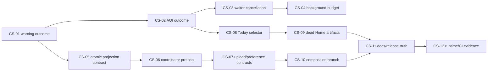

# Codebase Simplification Roadmap

## Objective and sequencing rule

This roadmap removes ambiguity and obsolete pathways from the recovered G5 architecture. It does not introduce a
new app architecture. The source audit at
`docs/audits/codebase-architecture-recovery.md` is the completed truth-recovery prerequisite.

Sequence work by safety and dependency:

Each issue starts by adding the specified characterization tests before production edits. Stop after one issue.
Do not combine independent cleanup merely because the files are nearby.

## Locked invariants

All issues must preserve:

- cached-first and resolve-forward Today presentation;
- useful same-location stale content on partial failure;
- authoritative-empty alerts;
- location/projection/source/revision identity boundaries;
- foreground/background/remote ingestion convergence and hot-alert priority;
- atomic production core and accepted SPC persistence;
- stable Local Alerts and Storm Setup identity;
- core publication before optional enrichment;
- Storm Setup expiration/backoff;
- risk-notification coalescing and 20/40/60 cadence;
- widget freshness, polygon interior rings, privacy-first location handling, and conservative notifications.

## Campaign 1 — Explicit absence and freshness semantics

### CS-01 — Preserve cached map warnings when warning lookup is unavailable

- **Finding IDs:** F-01.
- **Problem being removed:** warning query failure and confirmed-empty warning state both become `[]`.
- **Exact current evidence:** `MapFeatureModel.reload()` catches a warning-repository error, assigns
  `activeWarnings = []`, and passes that value into a new render plan. Existing tests do not cover success followed
  by warning failure.
- **Concept/pathway to eliminate:** the implicit "empty means failed" warning pathway.
- **Scope:** characterize and implement warning outcome handling at the existing model/planner boundary only.
- **Likely files/symbols:** `Sources/Features/Map/MapFeatureModel.swift`; existing map fetch-outcome/planner types if
  required; `Tests/UnitTests/MapFeatureModelWarningsTests.swift`.
- **Invariants:** known warnings remain visible during transient failure; a successful confirmed-empty query clears
  them; thematic stale/accepted behavior and render-plan identity remain unchanged.
- **Characterization first:** success → failure, initial failure, confirmed empty after success, thematic success
  with warning failure, cancellation, and selected-layer change.
- **Acceptance criteria:** failed/unavailable/canceled warning fetch preserves the prior warning slice and exposes
  degraded truth; confirmed empty clears; no generic outcome framework or scene-cache rewrite.
- **Focused test command:** `xcodebuild -project SkyAware.xcodeproj -scheme SkyAware -destination
  "platform=iOS Simulator,name=iPhone 17,OS=26.5" -only-testing:SkyAwareTests/MapFeatureModelWarningsTests
  -only-testing:SkyAwareTests/MapFeatureModelTests test`.
- **Build/runtime validation:** Debug build plus the focused Map UI smoke; inspect `.xcresult`. Device map inspection
  is desirable but not required for the semantic fix.
- **Prerequisites:** recovered audit only.
- **Cross-repository dependencies:** none.
- **Residual risk:** the warning repository failure is rare, so UI degraded-state copy may remain unobserved.
- **Stop conditions:** stop if the fix requires changing SPC transaction semantics, MapKit reconciliation, or
  scene-cache identity.
- **Expected complexity delta:** removes one lossy pathway and aligns warning freshness with existing thematic
  outcomes; one fewer special-case state transition; tests become sequentially representative.
- **Preferred model:** GPT-5.6 Terra, high reasoning.

### CS-02 — Preserve same-location AQI across skipped and failed refreshes

- **Finding IDs:** F-02.
- **Problem being removed:** `nil` means skipped, failed, and cleared, so a hot-only tick erases useful AQI.
- **Exact current evidence:** `.sessionTick` requests no AQI; executor publishes `airQuality == nil`; pipeline assigns
  it unconditionally. `sessionTick_skipsAQIRefreshWhileHotAlertsAreTheOnlyRequestedLane` proves the first half only.
- **Concept/pathway to eliminate:** optional value as a lossy refresh outcome.
- **Scope:** introduce a narrow enrichment outcome for AQI and adapt executor/pipeline mapping.
- **Likely files/symbols:** `HomeIngestionPublication`/enrichment value, `HomeIngestionExecutor`,
  `HomeRefreshPipeline.applyEnrichment`, Storm/pipeline tests.
- **Invariants:** core-before-enrichment; same-key useful AQI survives skip/failure; successful AQI replaces it;
  location-key change cannot show prior-location AQI; stale runs remain rejected.
- **Characterization first:** existing AQI → hot tick, AQI failure, AQI success, location change, mismatched run/key.
- **Acceptance criteria:** publication distinguishes update from preserve without adding persistence or a generic
  result hierarchy; Summary/detail/fallback behavior is unchanged.
- **Focused test command:** `xcodebuild -project SkyAware.xcodeproj -scheme SkyAware -destination
  "platform=iOS Simulator,name=iPhone 17,OS=26.5" -only-testing:SkyAwareTests/StormSetupIngestionTests
  -only-testing:SkyAwareTests/HomeRefreshPipelineTests test`.
- **Build/runtime validation:** Debug build, focused `.xcresult`, and the Today navigation UI smoke.
- **Prerequisites:** CS-01 establishes the campaign vocabulary, but no shared abstraction is required.
- **Cross-repository dependencies:** none for this issue; separately consider making the client response nonoptional
  only after ArcusCore/server contract confirmation.
- **Residual risk:** AQI remains volatile and nonpersistent by design.
- **Stop conditions:** stop if scope expands into Storm Setup cache/policy or server changes.
- **Expected complexity delta:** removes two ambiguous meanings from `nil`, one destructive transition, and a gap
  between fakes and visible behavior.
- **Preferred model:** GPT-5.6 Terra, high reasoning.

## Campaign 2 — Coordinator cancellation and task-budget ownership

### CS-03 — Make ingestion waiter cancellation explicit and race-safe

- **Finding IDs:** F-03.
- **Problem being removed:** caller cancellation does not remove/resume a waiter or bound its callbacks.
- **Exact current evidence:** checked continuations remain in `waiters` until `finishRun`; no cancellation handler
  exists; shared runs and waiter interest have one implicit lifetime.
- **Concept/pathway to eliminate:** orphaned waiter/callback pathway after the caller stops caring.
- **Scope:** waiter lifecycle only; do not redesign plan merging or execution serialization.
- **Likely files/symbols:** `HomeIngestionCoordinator.Waiter`, `enqueueAndWait`, waiter storage/removal/completion;
  `HomeIngestionCoordinatorTests`.
- **Invariants:** compatible requests still join; one pending plan still merges; one caller cannot cancel work useful
  to another; every continuation resumes exactly once; remote hot-alert absorption remains unchanged.
- **Characterization first:** cancel before storage, active joined waiter, pending waiter, one of multiple waiters,
  last waiter, finish/cancel race, progress/publication after cancellation.
- **Acceptance criteria:** canceled waiter promptly throws `CancellationError`, receives no later callbacks, and is
  removed exactly once; shared-run cancellation policy remains explicit and conservative.
- **Focused test command:** `xcodebuild -project SkyAware.xcodeproj -scheme SkyAware -destination
  "platform=iOS Simulator,name=iPhone 17,OS=26.5" -only-testing:SkyAwareTests/HomeIngestionCoordinatorTests test`.
- **Build/runtime validation:** Debug build; coordinator plus pipeline/remote/background focused suites; Thread
  Sanitizer only if deterministic race tests expose uncertainty.
- **Prerequisites:** none.
- **Cross-repository dependencies:** none.
- **Residual risk:** deciding whether an interest-free active run should continue is policy; default to continuing in
  this issue to preserve cache/widget side effects.
- **Stop conditions:** stop if the patch changes plan compatibility, pending merge, provider orchestration, or
  lifecycle trigger count.
- **Expected complexity delta:** separates shared execution ownership from waiter ownership; removes orphaned
  callbacks and an unbounded caller state; makes cancellation tests representative.
- **Preferred model:** GPT-5.6 Sol, high reasoning, because actor reentrancy and continuation races cross lifecycle
  callers.

### CS-04 — Bound background upload draining inside the OS cancellation scope

- **Finding IDs:** F-03, F-04.
- **Problem being removed:** pre-ingestion draining may use retry delays outside cancellation and consume the
  notification/ingestion budget.
- **Exact current evidence:** orchestrator awaits the drainer before its cancellation handler; the durable pusher
  uses 0/5/15-second retry delays; tests intentionally lock drain-before-ingestion and early-exit drain.
- **Concept/pathway to eliminate:** unbounded "drain everything before useful work" semantics.
- **Scope:** define a bounded drain attempt/outcome and cover the whole background run with cancellation. Preserve
  current ordering unless tests and runtime evidence justify a later issue.
- **Likely files/symbols:** `BackgroundOrchestrator`, pending-upload drainer protocol,
  `LocationSnapshotPusher.drainPendingUploads`, cadence tests, location provider tests.
- **Invariants:** pending uploads receive an attempt even when later work exits; ingestion and notifications retain a
  budget; queued payloads survive partial drain; cadence/health are accurate.
- **Characterization first:** one item, backlog, missing token, retry delay, expiration during drain, early exit,
  cancellation during ingestion, and remaining queue.
- **Acceptance criteria:** explicit quota/deadline and outcome; OS cancellation covers pre-drain; remaining work stays
  durable; no detached task or silent drop.
- **Focused test command:** `xcodebuild -project SkyAware.xcodeproj -scheme SkyAware -destination
  "platform=iOS Simulator,name=iPhone 17,OS=26.5" -only-testing:SkyAwareTests/BackgroundOrchestratorCadenceTests
  -only-testing:SkyAwareTests/LocationProviderTests test`.
- **Build/runtime validation:** Debug build, focused `.xcresult`, then a physical-device BG run with seeded backlog
  before declaring budget improvement.
- **Prerequisites:** CS-03.
- **Cross-repository dependencies:** none.
- **Residual risk:** BG scheduling is discretionary; deterministic timing tests cannot prove OS behavior.
- **Stop conditions:** stop if correctness requires changing payload coalescing, retry policy globally, notification
  cadence, or moving drain after ingestion.
- **Expected complexity delta:** removes an unbounded pathway; adds one explicit bounded outcome; clarifies OS,
  orchestrator, and pusher ownership.
- **Preferred model:** GPT-5.6 Sol, high reasoning, for cross-lifecycle sequencing and cancellation.

## Campaign 3 — Persistence and protocol contract strengthening

### CS-05 — Require production-equivalent atomic core commits

- **Finding IDs:** F-05.
- **Problem being removed:** protocol conformers can implement a transaction as three partial saves via a default.
- **Exact current evidence:** the default `commitCore` calls `updateWeather`, `updateSlowProducts`, and
  `updateHotAlerts`; production performs one model-actor mutation/save.
- **Concept/pathway to eliminate:** weaker fallback transaction semantics.
- **Scope:** remove the default, implement atomic behavior explicitly in all conformers/fakes, and characterize
  failure atomicity. Do not remove individual update APIs yet.
- **Likely files/symbols:** `HomeProjectionPersisting`, `HomeProjectionStore`, projection test stores/executor fakes.
- **Invariants:** one core baseline, skipped slices preserve, authoritative-empty alerts clear, risk delta uses
  persisted old/new truth, one location key only.
- **Characterization first:** failure after each logical slice, partial optional commit fields, authoritative empty,
  and risk-change comparison.
- **Acceptance criteria:** every core-writing conformer states atomic behavior; no default decomposition; test fake
  rollback/results match production contract.
- **Focused test command:** `xcodebuild -project SkyAware.xcodeproj -scheme SkyAware -destination
  "platform=iOS Simulator,name=iPhone 17,OS=26.5" -only-testing:SkyAwareTests/HomeProjectionStoreTests
  -only-testing:SkyAwareTests/StormSetupIngestionTests test`.
- **Build/runtime validation:** Debug build, focused suites, full unit target once.
- **Prerequisites:** none.
- **Cross-repository dependencies:** none.
- **Residual risk:** deterministic fakes may need explicit staging without reproducing SwiftData internals.
- **Stop conditions:** stop if the issue begins redesigning projection schema/readiness or splitting the store.
- **Expected complexity delta:** removes one semantically false fallback and makes tests represent one transaction
  contract.
- **Preferred model:** GPT-5.6 Terra, high reasoning, for the SwiftData boundary.

### CS-06 — Collapse ingestion coordination to one semantic protocol operation

- **Finding IDs:** F-06.
- **Problem being removed:** overload defaults silently discard progress then publication.
- **Exact current evidence:** six protocol requirements/defaults represent one request operation; production
  implements the full callback form while partial fakes can ignore callbacks.
- **Concept/pathway to eliminate:** overload-resolution-dependent behavior.
- **Scope:** define one required request operation carrying optional progress/publication; retain convenience methods
  only as non-semantic forwarding helpers.
- **Likely files/symbols:** `HomeIngestionCoordinating`, coordinator implementation, pipeline/background/remote
  call sites, fakes.
- **Invariants:** request plan/compatibility, callbacks, joining, pending merge, and result satisfaction remain exact.
- **Characterization first:** each caller surface reaches the canonical operation and callbacks are preserved.
- **Acceptance criteria:** one semantic requirement; no default drops data; named conveniences forward all supplied
  values; conformers fail compilation if incomplete.
- **Focused test command:** `xcodebuild -project SkyAware.xcodeproj -scheme SkyAware -destination
  "platform=iOS Simulator,name=iPhone 17,OS=26.5" -only-testing:SkyAwareTests/HomeIngestionCoordinatorTests
  -only-testing:SkyAwareTests/HomeRefreshPipelineTests -only-testing:SkyAwareTests/RemoteHotAlertHandlerTests test`.
- **Build/runtime validation:** Debug build and full unit target.
- **Prerequisites:** CS-03, so the canonical method includes correct waiter lifetime.
- **Cross-repository dependencies:** none.
- **Residual risk:** mechanical call-site churn can obscure the semantic no-op; keep it separate from other protocols.
- **Stop conditions:** stop if compatibility/merge logic changes or a new request object duplicates
  `HomeIngestionRequest`.
- **Expected complexity delta:** removes five semantic entry surfaces and two callback-dropping pathways; clarifies
  one owner.
- **Preferred model:** GPT-5.6 Luna, high reasoning.

### CS-07 — Require explicit upload and preference side effects

- **Finding IDs:** F-06.
- **Problem being removed:** critical protocol conformers can inherit silent no-op drain/preference behavior.
- **Exact current evidence:** location upload/drain and preference protocols expose default no-ops; production live
  wiring is explicit, but test/compatibility conformers can omit behavior.
- **Concept/pathway to eliminate:** unnamed silent partial conformance.
- **Scope:** inventory conformers, require explicit operations, keep named no-op implementations only where a caller
  intentionally opts out.
- **Likely files/symbols:** `LocationSnapshotPusher` protocols, `HTTPLocationSnapshotUploader`, device preference
  uploader, dependencies, fakes/tests.
- **Invariants:** durable coalescing/retry, token gating, semantic dedupe, preference ordering, privacy.
- **Characterization first:** every production composition path selects a live or explicitly named no-op type;
  enqueue/drain/preferences remain observable in fakes.
- **Acceptance criteria:** no critical side effect is supplied by a blank protocol extension; intentional no-op is
  visible at construction.
- **Focused test command:** `xcodebuild -project SkyAware.xcodeproj -scheme SkyAware -destination
  "platform=iOS Simulator,name=iPhone 17,OS=26.5" -only-testing:SkyAwareTests/LocationProviderTests
  -only-testing:SkyAwareTests/HTTPLocationSnapshotUploaderTests
  -only-testing:SkyAwareTests/HTTPDevicePreferenceSyncUploaderTests test`.
- **Build/runtime validation:** Debug build and full unit target.
- **Prerequisites:** CS-04 if the drainer signature gains a bounded outcome.
- **Cross-repository dependencies:** none.
- **Residual risk:** previews/UI tests may need explicit no-op wiring.
- **Stop conditions:** stop if work expands into payload or server endpoint changes.
- **Expected complexity delta:** removes silent behaviors, clarifies all composition choices, and makes fakes more
  representative.
- **Preferred model:** GPT-5.6 Luna, high reasoning.

## Campaign 4 — Today presentation clarity and obsolete generation retirement

### CS-08 — Characterize and centralize Today display selection

- **Finding IDs:** F-07.
- **Problem being removed:** per-slice current-key/cache/stage arbitration is distributed through `HomeView`.
- **Exact current evidence:** the view observes persisted `@Query` data plus pipeline state and independently computes
  displayed projection, weather, risks, alerts, Storm Setup, and AQI.
- **Concept/pathway to eliminate:** duplicated presentation-selection branches, not cached-first state.
- **Scope:** first build a pure input/output matrix, then extract one non-observable selector/value snapshot.
- **Likely files/symbols:** `HomeView` displayed-value helpers, existing Today presentation/state types,
  `HomeView*Tests`, `TodaySurfaceStateFlowTests`.
- **Invariants:** cached-first, resolve-forward, partial failure, location isolation, stable Local Alerts/Storm slot,
  staged publication and refresh affordances.
- **Characterization first:** no cache, matching cache, old-location cache, core stage, enrichment stage, partial
  failure, authoritative empty, location transition, stale submission.
- **Acceptance criteria:** view consumes one coherent presentation snapshot; no second observable owner, repository,
  coordinator, or app-wide architecture pattern; existing structural IDs unchanged.
- **Focused test command:** `xcodebuild -project SkyAware.xcodeproj -scheme SkyAware -destination
  "platform=iOS Simulator,name=iPhone 17,OS=26.5" -only-testing:SkyAwareTests/TodaySurfaceStateFlowTests
  -only-testing:SkyAwareTests/HomeViewStateTests -only-testing:SkyAwareTests/HomeRefreshPipelineTests test`.
- **Build/runtime validation:** Debug build, full unit target, Today UI smoke; compare Release-device traces before
  claiming invalidation improvement.
- **Prerequisites:** CS-02 so AQI preservation is part of the canonical matrix.
- **Cross-repository dependencies:** none.
- **Residual risk:** an extraction can become a view model by stealth; keep it pure and value-based.
- **Stop conditions:** stop if it requires changing `@Query` scope, pipeline ownership, Summary composition, or
  animation identity. Those need separate evidence.
- **Expected complexity delta:** consolidates repeated selection pathways and one presentation responsibility; does
  not reduce essential source identities.
- **Preferred model:** GPT-5.6 Terra, high reasoning.

### CS-09 — Remove obsolete Home model and inert initializer policies

- **Finding IDs:** F-08.
- **Problem being removed:** dead compiled ownership and configuration that has no effect.
- **Exact current evidence:** `HomeScreenModel` has no references; six pipeline initializer parameters are declared
  but unread.
- **Concept/pathway to eliminate:** one obsolete model and six fake policy knobs.
- **Scope:** two small commits or two review checkpoints: delete the unused type; remove inert parameters/call-site
  arguments.
- **Likely files/symbols:** `HomeScreenModel.swift`, `HomeRefreshPipeline.init`, tests/call sites.
- **Invariants:** zero functional behavior change; current trigger plans and timings stay exact.
- **Characterization first:** reference scan and tests that assert timer/manual/activation trigger mapping.
- **Acceptance criteria:** no references, no replacement abstraction, no unrelated formatting; project builds.
- **Focused test command:** `xcodebuild -project SkyAware.xcodeproj -scheme SkyAware -destination
  "platform=iOS Simulator,name=iPhone 17,OS=26.5" -only-testing:SkyAwareTests/HomeRefreshPipelineTests
  -only-testing:SkyAwareTests/HomeViewStateTests test`.
- **Build/runtime validation:** Debug build and full unit target.
- **Prerequisites:** CS-08 avoids deleting a type before presentation ownership is explicit.
- **Cross-repository dependencies:** none.
- **Residual risk:** external/untracked consumers do not exist for app-internal symbols.
- **Stop conditions:** stop if any parameter is read by conditional compilation or UI-test fixtures.
- **Expected complexity delta:** removes one obsolete-generation type, six inert transitions/configuration concepts,
  and their tests/call-site noise.
- **Preferred model:** GPT-5.6 Luna, medium reasoning.

### CS-10 — Make Arcus live composition policy internally consistent

- **Finding IDs:** F-09.
- **Problem being removed:** a fatal URL read precedes a branch that claims to support a missing URL with no-ops.
- **Exact current evidence:** `Dependencies.live()` calls `ArcusSignalConfiguration.baseURL()` before
  `configuredBaseURL()` determines live/no-op upload and preference wiring.
- **Concept/pathway to eliminate:** unreachable degraded-production composition.
- **Scope:** characterize valid/missing configuration and select one explicit policy; retain manual composition.
- **Likely files/symbols:** `Dependencies.live`, `ArcusSignalConfiguration`, onboarding/config tests.
- **Invariants:** production does not silently disable alerts/uploads/preferences; previews/tests remain explicit;
  secrets stay outside source.
- **Characterization first:** missing/malformed/valid URL and onboarding service-availability behavior.
- **Acceptance criteria:** one URL resolution, one documented fail-fast policy, no impossible branch; explicit
  preview/test no-ops if needed.
- **Focused test command:** `xcodebuild -project SkyAware.xcodeproj -scheme SkyAware -destination
  "platform=iOS Simulator,name=iPhone 17,OS=26.5" -only-testing:SkyAwareTests/LaunchAndOnboardingStateTests
  -only-testing:SkyAwareTests/ArcusHttpClientTests test`.
- **Build/runtime validation:** Debug build with normal config; configuration unit tests.
- **Prerequisites:** CS-07 clarifies explicit no-op types.
- **Cross-repository dependencies:** none.
- **Residual risk:** developer preview behavior may rely on current bundle configuration outside tests.
- **Stop conditions:** stop if the work proposes a DI framework, service locator, or file split unrelated to policy.
- **Expected complexity delta:** removes one unreachable branch and duplicate configuration lookup; clarifies
  production ownership.
- **Preferred model:** GPT-5.6 Luna, medium reasoning.

## Campaign 5 — Canonical documentation and validation truth

### CS-11 — Reconcile current architecture, campaign status, and release identity

- **Finding IDs:** F-10.
- **Problem being removed:** current truth is spread across contradictory architecture, release, runbook, ledger, tag,
  and project metadata.
- **Exact current evidence:** release docs/tags say build 94 while tagged/current project says 80; `Unreleased` is
  empty after PR #328; the app summary and top-level campaign states contradict source/detailed ledgers; upload-order
  audit text is stale.
- **Concept/pathway to eliminate:** multiple unlabeled candidates for current architecture/release truth.
- **Scope:** documentation/process only: define authorities, correct current docs/statuses, mark point-in-time audits,
  and explain or explicitly leave unresolved the build-number source.
- **Likely files/symbols:** release docs, app summary, release readiness, three campaign runbooks/progress ledgers,
  release tooling documentation.
- **Invariants:** historical evidence remains auditable; do not rewrite old results as if contemporaneous; published
  release claims remain accurate.
- **Characterization first:** inventory tag → commit → project version → release-doc claims and current code status.
- **Acceptance criteria:** one documented release-truth procedure; current architecture doc matches G5; status headers
  agree with detailed ledgers; `Unreleased` reflects post-release user impact; unresolved build provenance is
  explicit rather than guessed.
- **Focused test command:** documentation-only: `git diff --check`; scripted tag/project/release-value comparison if
  added as a non-mutating tool.
- **Build/runtime validation:** no product build required unless release tooling changes; dry-run note generation.
- **Prerequisites:** CS-01-CS-10, or explicitly document their pre-change state and update again later.
- **Cross-repository dependencies:** none.
- **Residual risk:** Xcode Cloud may mutate build numbers outside the repository; document external authority.
- **Stop conditions:** stop rather than inventing how build 94 was created; do not alter project version without a
  release decision.
- **Expected complexity delta:** retires stale current-truth documents/statuses and identifies one release authority;
  reduces historical reconstruction cost.
- **Preferred model:** GPT-5.6 Luna, high reasoning.

### CS-12 — Make validation lanes and missing device evidence explicit

- **Finding IDs:** F-10; runtime-gap watchlist.
- **Problem being removed:** unit/UI/device/trace evidence can be mistaken for one another, and current physical-device
  Today evidence is incomplete.
- **Exact current evidence:** default plan runs units, all-tests plan successfully runs UI; historical Today ledger
  lacks comparable Release traces for seven named scenarios; three test compiler warnings remain.
- **Concept/pathway to eliminate:** ambiguous "tests passed/performance improved" validation claims.
- **Scope:** document or configure explicit unit/UI lanes; clean warning hygiene separately if needed; execute the
  existing physical-device scenario matrix without reopening optimization.
- **Likely files/symbols:** test plans/CI documentation, Today performance progress ledger, trace artifacts;
  warning-producing tests only in a separate mechanical review unit.
- **Invariants:** no live WeatherKit/NWS/SPC/Arcus requests in deterministic tests; UI identifiers remain stable;
  runtime claims require comparable Release evidence.
- **Characterization first:** record commands, device/OS/build/configuration, signpost windows, and trace comparability
  before capture.
- **Acceptance criteria:** CI or runbook explicitly invokes both intended plans; every `.xcresult` is inspected;
  physical-device matrix records pass/gap with artifacts; no optimization issue is created without regression
  evidence.
- **Focused test command:** `xcodebuild -project SkyAware.xcodeproj -scheme SkyAware -testPlan
  SkyAware_All_Tests -destination "platform=iOS Simulator,name=iPhone 17,OS=26.5"
  -only-testing:SkyAwareUITests/SkyAwareUITests/testTabNavigationLoadsEachPrimaryView test`.
- **Build/runtime validation:** Release physical-device captures for cold/no-cache, authoritative-empty, Storm
  loading/success/failure, partial core failure, rapid lifecycle, scrolling reversal/completion, warm/manual refresh.
- **Prerequisites:** CS-11 for authoritative recording locations.
- **Cross-repository dependencies:** none; deterministic fixtures only.
- **Residual risk:** device/OS variance makes non-identical traces incomparable.
- **Stop conditions:** stop if captures are not same build/config/device scenario; do not infer performance from gate
  tests.
- **Expected complexity delta:** consolidates evidence vocabulary and validation pathways; removes ambiguous status
  transitions rather than changing production architecture.
- **Preferred model:** GPT-5.6 Luna, high reasoning for CI/docs; Terra, high reasoning only for trace interpretation.

## Deferred or rejected proposals

- No DI framework or module extraction: manual composition and actor boundaries are clear.
- No ingestion rewrite: serialization/joining is valuable; only waiter lifetime needs repair.
- No projection schema redesign: production atomic/readiness behavior is strong.
- No generic fetch-outcome framework: fix warning and AQI semantics locally before considering shared vocabulary.
- No Map scene-warming removal or Home query narrowing without current device traces.
- No reopening organization, Today state-flow/performance, Map, notification, location-hardening, or Storm Setup
  campaigns absent a demonstrated regression.
