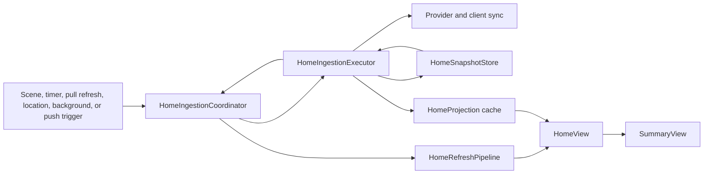

# Storm Setup Implementation Runbook

**Status:** Investigation complete; implementation not started

**Feature surface:** Today / Summary with drill-in detail

**Target implementation model:** GPT-5.4 Mini medium unless an issue says otherwise

Storm Setup translates short-range model ingredients into local severe-weather awareness:

> Are the ingredients coming together, and what is holding them back?

This runbook is the durable source of cross-issue context. Follow-up implementation prompts should point here instead
of repeating the feature purpose, product hierarchy, fetch/show rules, payload field inventory, or architectural
guardrails.

## Source of Truth

Read these in order before implementing any Storm Setup issue:

1. `AGENTS.md`
2. `Sources/AGENTS.md`
3. `tasks/lessons.md`
4. The current Storm Setup issue
5. This runbook
6. `docs/SkyAware North Star Spec.md`
7. `docs/plans/today-state-flow-runbook.md`
8. The production and test files named by the current issue

The current issue defines the review unit. This runbook defines the feature-wide contract.

## Locked Product Decisions

- Storm Setup belongs on Today / Summary with a drill-in detail view.
- Do not add a top-level tab in v1.
- Translate meaning before exposing numbers.
- Official warnings, watches, and mesoscale discussions outrank model guidance.
- Use “HRRR guidance” and “forecast model,” never language that implies observed truth.
- Do not show Storm Setup and Atmospheric Conditions as equal, overlapping full-weight sections.
- When a full Storm Setup card is visible, suppress the full Atmospheric Conditions card.
- When Storm Setup is disabled, unavailable, expired, or not selected for display, Atmospheric Conditions remains the
  fallback.
- Keep the summary card calm, compact, typography-led, and atmospheric.
- Reuse the existing cool blue-gray atmospheric treatment and shared card/radius/press styles.
- Reserve risk colors for actual risk semantics.
- Do not expose URLs, debug pressure levels, internal endpoint names, or “Weather Nerd Mode.”
- Detailed values are optional and controlled by `Detailed Ingredients`.
- Quiet-day hiding is the v1 default. Do not build a compact quiet row in the initial implementation.
- Local DTOs are correct for v1. Do not block this feature on ArcusCore model work.
- Storm Setup must follow the same cached-first, resolve-forward strategy as the rest of Today: render persisted
  location-scoped guidance immediately, refresh it without clearing useful content, and replace it only with a newer
  successful value for the same location.
- Persist successful Storm Setup responses in SwiftData. In-memory or URL-cache-only storage is insufficient.
- Eligible background ingestion runs must refresh and persist Storm Setup when the feature setting is on. Storm Setup
  is not a foreground-only feature.
- Treat the observed roughly two-second response time as normal. The request must remain off the main actor, must not
  introduce a Storm Setup-specific blocking surface, and must fail open to cached guidance or the Atmospheric
  Conditions fallback.

## Investigation Findings

### Current Summary composition

`Sources/App/HomeView.swift` owns the five-tab shell. Today already has its own `NavigationStack`, so Storm Setup can
push a detail view without changing tab architecture.

`Sources/Features/Summary/SummaryView.swift` currently renders:

1. `SummaryStatus`
2. `PrimaryAwarenessPanel`
3. `AtmosphericConditionsCard`
4. optional location-reliability rail
5. `ActiveAlertSummaryView`
6. `OutlookSummaryCard`
7. attribution

The source order is static. Storm Setup requires a small, explicit section-composition decision because populated
Local Alerts must move above model guidance while the Local Alerts empty state should remain lower.

`PrimaryAwarenessPanel` already promotes an active warning or watch above risk signals, but it does not consume
mesoscale discussions. `ActiveAlertSummaryView` is still the canonical section for both alerts and mesos.

### Atmospheric Conditions

`Sources/Features/Badges/AtmosphereRailView.swift` owns the full current rail and its pure
`AtmosphericConditionsDisplayModel`. It displays WeatherKit-derived dew point, humidity, wind, and pressure.

The card already supplies the correct visual family for Storm Setup:

- cool blue-gray gradient
- shared card backgrounds and continuous radii
- restrained shadow
- typography-led hierarchy
- adaptive metric layout

Do not mutate this card into Storm Setup. Preserve it as a fallback and build a separate Storm Setup card that reuses
its visual language. The two surfaces have different product responsibilities.

### Local Alerts behavior

`LocalAlertsDisplayState` distinguishes unavailable, loading, populated, and confirmed-empty states with cache
provenance. Use `presentationState == .alerts` to decide whether official local information moves ahead of Storm
Setup. Do not infer section ordering directly from raw array counts because the display state owns whether those
arrays are useful current/cached content.

For Storm Setup fetch eligibility, active severe context includes either:

- at least one `AlertDTO`, or
- at least one `MdDTO`

### Settings and flags

The app uses `@AppStorage` with `UserDefaults.shared`. There is no general feature-flag framework. Adding one solely
for Storm Setup would be ceremony, not architecture.

Use two stable settings keys:

- `stormSetupEnabled`
- `detailedIngredientsEnabled`

Recommended initial defaults:

- Storm Setup: on once the production endpoint contract is stable
- Detailed Ingredients: off

While development depends on an Anvil/dev endpoint, land `stormSetupEnabled` default-off. Flip the default only in a
separate, explicit rollout issue after production endpoint validation. `Detailed Ingredients` may remain stored when
Storm Setup is off, but its effective value must be false until Storm Setup is enabled.

The `Detailed Ingredients` setting is also the requested quiet-day override: when effectively enabled, it forces
eligible fetch and full-card display. Do not add a third user-facing “always show” toggle in v1.

The Settings labels should be:

- `Storm Setup`
- `Detailed Ingredients`

Do not use “Enable Storm Setup,” “HRRR Endpoint,” “Anvil Debug,” or playful expert-mode language.

### Existing data architecture

Home data follows one serialized path:



`HomeIngestionCoordinator` serializes and merges requests. `HomeIngestionExecutor` resolves location, syncs hot alerts
and slow SPC products, refreshes WeatherKit, assembles `HomeSnapshot`, and updates the location-keyed
`HomeProjection`. `HomeRefreshPipeline` commits snapshots to observable main-actor state. `HomeView` selects cached
projection values versus current pipeline values.

Storm Setup must join this path. A feature-local `Task` in `SummaryView` would duplicate refresh, cancellation,
location, cache, and failure semantics and is rejected.

Cache-forward parity is a requirement, not an implementation detail:

1. `HomeView` reads the current location's persisted Storm Setup from SwiftData on launch.
2. Today renders that unexpired value before a network refresh completes.
3. Foreground and background ingestion evaluate the same eligibility policy.
4. A successful response updates the location-keyed projection and the current snapshot.
5. A skipped, slow, cancelled, or failed response preserves the prior unexpired value.
6. An expired or wrong-location value is never carried forward.

This matches the existing Today strategy for weather, risks, alerts, and mesos: persisted content is the immediate
display source, while a newer ingestion result resolves forward.

### Arcus-Signal clients

`ArcusSignalConfiguration` owns the current base URL and route constants. `ArcusHttpClient` is alert-specific and
returns only `Data`; it also updates reachability that currently drives the app-wide offline token.

Add a dedicated Storm Setup client rather than widening the alert client. A Storm Setup failure must not mark the
entire Today surface offline when WeatherKit, SPC, and official alerts remain available.

The exact production Storm Setup route, query items, and Anvil/dev route are not present in this repository. Before
network implementation, obtain and commit:

- the exact route and HTTP method
- required location inputs (`h3`, latitude/longitude, or another scope)
- one representative success fixture
- one quiet/partial fixture
- one stale/degraded fixture
- status semantics for unavailable guidance

Do not guess an endpoint contract in production code.

### DTO and domain boundary

Decode the payload into local `Codable & Sendable & Equatable` DTOs. Keep wire values tolerant:

- assessment categories should decode as strings, then normalize in a mapper
- optional or newly added raw fields must not fail the whole payload
- unknown assessment strings should map to an unavailable/unknown display value, not a decode failure
- raw URLs, if present, must not enter display models

Use three boundaries:

1. `StormSetupDTO`: complete local wire representation.
2. `StormSetupAssessment`: normalized app-domain values and freshness/provenance.
3. `StormSetupSummaryDisplayModel` / detail display models: formatted copy and rows for SwiftUI.

Views must not interpret `overall`, threshold raw values, choose limiters, or format model metadata.

### Freshness and resolve-forward behavior

Storm Setup payload freshness is feed-specific and must not be collapsed into `TodayContentState` or global network
reachability.

Normalize freshness using payload metadata:

- stale when `freshness.isStale` is true
- degraded when `freshness.isDegraded` is true
- expired when `now >= freshness.expiresAt`

Display stale or degraded, unexpired guidance with restrained neutral status copy. Do not apply risk colors.

At or after `expiresAt`, suppress the Storm Setup card and show Atmospheric Conditions instead. This prevents an old
model setup from surviving indefinitely in `HomeProjection`. On refresh failure, retain the cached Storm Setup only
while it remains unexpired. Never replace good cached guidance with `nil` merely because a transient request failed.

Location changes are already isolated by `HomeProjection.projectionKey`. Do not carry a Storm Setup value across a
different projection key.

### Background participation and endpoint latency

Storm Setup participates in both foreground and background home ingestion. A background run must evaluate the same
feature, risk, alert, and Detailed Ingredients inputs as a foreground run. When the feature is disabled, the
background run makes no Storm Setup request. When enabled and eligible, the background run awaits the request within
its execution budget and persists a successful response before completing.

The endpoint currently returns in roughly two seconds. Design for that as a routine secondary-feed latency:

- never perform the request on `@MainActor`
- never clear or hide unexpired cached guidance while it is in flight
- do not add a Storm Setup-specific loading surface; bound any contribution to the existing unified foreground run
- keep official alerts, SPC risks, WeatherKit, and the rest of the home snapshot usable if Storm Setup is slow or fails
- apply a bounded foreground wait/timeout appropriate to the observed latency, then fail open
- allow the background request to use the existing background HTTP execution policy and cancellation budget
- log request duration and outcome without logging coordinates, raw payloads, or advanced values

SS-05 must add deterministic latency tests with a suspended fake query. The tests should prove cached content remains
selected while the request is pending and that timeout/failure does not fail the overall home ingestion run.

### Navigation

Today already owns a `NavigationStack`. Make the complete Storm Setup summary card a `NavigationLink` to
`StormSetupDetailView`. Avoid a view-owned network request in the destination; pass the already resolved assessment
and local time zone.

An info button inside the detail view may present the model-guidance explanation sheet. Avoid nested buttons inside
the summary card’s navigation link.

### Testing patterns

The codebase uses Swift Testing with focused pure-value suites. Relevant examples include:

- `AtmosphericConditionsDescriptorTests`
- `SummaryAwarenessPanelTests`
- `HomeRefreshPipelineTests`
- `HomeProjectionStoreTests`
- `HomeIngestionCoordinatorTests`
- `HomeViewLoadingOverlayStateTests`
- `NwsHttpClientTests` for HTTP request construction

Prefer pure policy, mapping, and formatting tests. Use fake clients/providers at ingestion seams. Do not hit live
Arcus, HRRR, Anvil, SPC, NWS, or WeatherKit services.

## Recommended Architecture

### 1. Contract and mapping

Create local Storm Setup DTOs and a pure mapper. The readable assessment is authoritative for presentation; do not
recompute meteorological thresholds from raw values in the app.

Required readable fields:

- `overall`
- `summary`
- `instability`
- `moisture`
- `lowLevelRotation`
- `deepShear`
- `cloudBase`
- `capInhibition`
- `limitingFactors`
- `confidence`
- `primaryDrivers`
- `stormMode`
- `stormModeHint`
- `trend`
- `compositeSignal`

Required source/freshness fields:

- `isStale`
- `isDegraded`
- `modelRunTime`
- `sourceValidTime`
- `forecastHour`
- `fetchedAt`
- `expiresAt`
- model/product/domain/run/valid/field-set/source-kind provenance

Required raw/detail fields:

- CAPE variants
- CIN
- 0–1 km and 0–3 km SRH
- 0–6 km shear
- MLLCL
- temperature/dew-point spread
- 3CAPE
- SCP, STP, and SHIP support when present
- effective-layer, storm-motion, profile-level, and quality-warning diagnostics

Keep every advanced field optional. Render only rows with meaningful values.

### 2. Fetch policy

Represent fetch eligibility as a pure function. The feature gate applies to the entire expression:

```text
stormSetupEnabled
AND (
    stormRisk >= marginal
    OR severeRisk != allClear
    OR active AlertDTO exists
    OR active MdDTO exists
    OR effectiveDetailedIngredientsEnabled
)
```

This policy intentionally cannot discover a model-only supportive setup on a day where SPC, severe risk, alerts, and
Detailed Ingredients are all quiet. That is the battery/network tradeoff in the requested v1 rule, not a bug.

Evaluate this policy after the executor has assembled current risk and alert inputs. Storm Setup is a conditional
enrichment stage inside an existing ingestion run; do not add a new coordinator or view-owned fetch path.

Use payload `expiresAt` to avoid unnecessary successful refetches. Add a short failed-attempt backoff so the
two-minute session tick cannot hammer a degraded endpoint.

Background runs use this same policy. “Refresh in background when Storm Setup is on” does not mean bypassing the
quiet-day gates: enabled is required, and the risk/alert/Detailed Ingredients eligibility inputs still decide whether
the endpoint call is useful.

### 3. Show policy

Represent presentation selection separately:

```text
stormSetupEnabled
AND unexpiredAssessmentExists
AND (
    assessment.overall is supportive or strong
    OR active AlertDTO exists
    OR active MdDTO exists
    OR effectiveDetailedIngredientsEnabled
)
```

Unknown assessment values do not independently qualify the card. An official alert/meso or Detailed Ingredients may
still force display, with unknown ingredients rendered as unavailable rather than invented.

### 4. Persistence and snapshot propagation

Persist the latest successful `StormSetupDTO` as an optional, location-keyed slice of `HomeProjection`, with a
`lastStormSetupLoadAt` timestamp. Optional schema additions preserve existing projections.

Add Storm Setup to `HomeSnapshot` and propagate it through `HomeRefreshPipeline` and `HomeView` using the same
projection-versus-pipeline selection rule as risk and weather.

SwiftData persistence is part of the MVP contract. It provides launch-time display, same-location cache-forward
behavior, background-to-foreground handoff, and protection from a routinely slow endpoint. Do not substitute an
in-memory property, `URLCache`, or a view-owned cache.

On refresh:

- write only a successfully decoded response for the same projection key
- retain the existing record on skip, timeout, cancellation, or failure
- publish the fresh value through the returned `HomeSnapshot`
- prefer the current pipeline value only when it belongs to the current location; otherwise use the selected
  projection
- apply payload expiry at presentation time so persisted data can remain available for diagnostics without being
  shown indefinitely

Do not add a separate Storm Setup SwiftData repository in v1. `HomeProjection` is already the location-scoped cache
for Today display state. A separate repository would add synchronization and cleanup work without a current consumer.

Do not add Storm Setup as a new `HomeIngestionLane` in v1. It is conditional enrichment based on the output of existing
hot-alert and slow-product work. Keeping it as an executor post-processing stage avoids broad changes to request
merging and resolution-state messaging. Reconsider a lane only if Storm Setup later needs an independent cadence or
non-Today consumers.

### 5. Summary composition

Introduce a pure section-composition model rather than scattering conditions through `SummaryView`.

When Local Alerts is populated:

1. Current Conditions
2. Primary Awareness / risk rails
3. Local Alerts
4. Storm Setup when show policy selects it; otherwise Atmospheric Conditions
5. optional location-reliability rail
6. compact Outlook Summary

When Local Alerts is not populated:

1. Current Conditions
2. Primary Awareness / risk rails
3. Storm Setup when selected; otherwise Atmospheric Conditions
4. optional location-reliability rail
5. Local Alerts loading, empty, or unavailable state when useful
6. compact Outlook Summary

Do not place the location-reliability prompt above populated Local Alerts. It is an app setup prompt, not weather
information.

The initial summary card should show:

- overall assessment and concise summary
- three fixed readable rows: Instability, Rotation, Cloud bases
- first meaningful limiting factor, if present
- one quiet source line such as `HRRR guidance · valid near 12 PM`

Use the payload’s readable labels. Do not derive “Strong,” “Supportive,” or “Low” from raw thresholds in SwiftUI.

### 6. Detail presentation

The detail view contains:

1. overall assessment
2. plain-language explanation
3. readable ingredient rows
4. limiting factors and primary drivers
5. source/freshness metadata
6. `Detailed Ingredients` section when effectively enabled
7. model-guidance info action

Format the model run in UTC (`17Z`) and valid time in the resolved location’s time zone. `HomeProjectionRecord` already
stores `timeZoneId`; pass that value through the Today boundary. Do not assume the device time zone matches the
forecast location.

Use `Advanced Details` as the v1 section label.

### 7. Anvil/dev supplementation

Do not make a production summary depend on a dev endpoint.

If the main Storm Setup response already contains `anvilEvidence`, render its optional support and diagnostics in
advanced detail. If a separate Anvil/dev call is needed, implement it as a later optional supplement with these rules:

- match responses by model run and valid time before merging
- never overwrite readable assessment fields
- never block or degrade the summary card
- hide debug-only pressure-level data
- discard unmatched or stale supplemental data
- keep the client behind explicit configuration until the endpoint is production-supported

## Alternatives Considered

### Recommended: unified ingestion enrichment

Fetch conditionally in `HomeIngestionExecutor`, persist in `HomeProjection`, propagate through `HomeSnapshot`, and
render from value models.

This preserves the current serialized refresh path, location scoping, cache roll-forward, background execution, and
test seams with the least new infrastructure.

### Rejected: feature-local Summary view model

A `StormSetupViewModel` that fetches from `.task` would appear smaller initially, but it would duplicate cancellation,
refresh cadence, offline fallback, location identity, persistence, and background behavior. It would also race the
risk and alert data needed for fetch eligibility.

### Deferred: dedicated Storm Setup repository and ingestion lane

A separate repository/lane becomes reasonable if widgets, notifications, maps, or historical trend views consume
Storm Setup independently. For a Summary-only v1, it increases schema, cleanup, coordinator, and freshness complexity
without a concrete payoff.

## Likely File Map

Exact filenames may be adjusted to match the final endpoint contract, but responsibilities should remain narrow.

### Create

- `Sources/Models/StormSetup/StormSetupDTO.swift` — local wire payload
- `Sources/Models/StormSetup/StormSetupAssessment.swift` — normalized domain values and mapper
- `Sources/Models/StormSetup/StormSetupPreferences.swift` — stable keys, effective settings, pure policy inputs
- `Sources/Clients/StormSetupClient.swift` — request construction, status handling, decoding
- `Sources/Interfaces/StormSetup/StormSetupQuerying.swift` — injected async boundary
- `Sources/Features/Summary/StormSetupPresentation.swift` — fetch/show/section policy and display mapping
- `Sources/Features/Summary/StormSetupSummaryCard.swift` — compact readable card
- `Sources/Features/Summary/StormSetupDetailView.swift` — detail, advanced section, info sheet
- focused Storm Setup test files under `Tests/UnitTests`

### Modify

- `Sources/App/ArcusSignalConfiguration.swift` — production route only after contract confirmation
- `Sources/App/Dependencies.swift` — compose the Storm Setup client and settings provider
- `Sources/App/HomeRefreshV2/HomeSnapshot.swift` — optional Storm Setup slice/result
- `Sources/App/HomeRefreshV2/HomeFreshnessState.swift` — attempt/success cadence state
- `Sources/App/HomeRefreshV2/HomeIngestionExecutor.swift` — conditional enrichment and failure retention
- `Sources/App/HomeRefreshPipeline.swift` — snapshot propagation
- `Sources/Models/Home/HomeProjection.swift` — optional cached payload and load timestamp
- `Sources/Repos/HomeProjectionStore.swift` — isolated Storm Setup update
- `Sources/App/HomeView.swift` — select cached/live setup, pass location time zone and preferences
- `Sources/Features/Settings/SettingsView.swift` — two user-facing settings
- `Sources/Features/Summary/SummaryView.swift` — policy-driven ordering and Atmospheric Conditions fallback

Avoid changing `AtmosphereRailView.swift` unless a later visual review identifies a reusable style extraction that is
small and clearly reduces duplication. Do not couple the first card implementation to such a refactor.

## Ordered Issue Breakdown

Each issue is one review unit. Stop after its validation and handoff.

| Order | ID | Goal | Recommended model | Risk |
|---:|---|---|---|---|
| 1 | SS-01 | Lock endpoint fixtures and add tolerant DTO/domain mapping | GPT-5.4 Mini medium | Medium |
| 2 | SS-02 | Add the dedicated Storm Setup HTTP client | GPT-5.4 Mini medium | Medium |
| 3 | SS-03 | Add settings, effective preferences, and pure fetch/show policy | GPT-5.4 Mini medium | Low |
| 4 | SS-04 | Add optional Storm Setup persistence to HomeProjection | GPT-5.4 Mini medium | Medium |
| 5 | SS-05 | Integrate conditional fetch and cache retention into home ingestion | GPT-5.4 Mini high | High |
| 6 | SS-06 | Propagate cached/live Storm Setup through Pipeline and HomeView | GPT-5.4 Mini medium | Medium |
| 7 | SS-07 | Add policy-driven Summary ordering and the readable card | GPT-5.4 Mini medium | Medium |
| 8 | SS-08 | Add detail, metadata, info copy, and advanced values | GPT-5.4 Mini medium | Medium |
| 9 | SS-09 | Add UI smoke coverage and final visual/accessibility validation | GPT-5.4 Mini medium | Low |
| 10 | SS-F01 | Optionally merge production-ready Anvil supplemental detail | GPT-5.5 medium | High |

Only SS-F01 warrants a larger model by default because matching two evolving meteorological contracts without
misrepresenting provenance is materially more complex. SS-05 should first use Mini high with a narrow issue; escalate
only if the implementation cannot stay within the stated file and behavior boundary.

### SS-01 — Contract fixtures and mapping

**Goal:** Make the existing payload a tested local contract without networking or UI.

**Scope:**

- commit sanitized representative fixtures
- add tolerant nested DTOs
- add normalized assessment/freshness/provenance models
- map unknown and missing readable values safely

**Likely production files:** two new model files

**Approximate diff:** 120–180 production lines plus fixtures/tests

**Out of scope:** HTTP, persistence, settings, fetch policy, SwiftUI

**Acceptance criteria:**

- success, quiet/partial, stale/degraded, and unknown-value fixtures decode
- missing optional advanced values do not fail decoding
- unknown readable categories remain non-crashing and non-qualifying
- raw URLs are absent from display/domain models

**Verification:**

```bash
xcodebuild -project SkyAware.xcodeproj -scheme SkyAware \
  -destination "platform=iOS Simulator,name=iPhone 17" \
  -only-testing:SkyAwareTests/StormSetupMappingTests test
```

### SS-02 — HTTP client

**Goal:** Fetch and decode Storm Setup through an injected, endpoint-specific client.

**Scope:**

- add the confirmed route/query configuration
- build requests with existing `HTTPClient`
- classify non-success responses
- return typed DTOs
- keep Storm Setup reachability separate from the app-wide alert reachability signal

**Likely production files:** client, query protocol, configuration

**Approximate diff:** 100–160 production lines

**Out of scope:** ingestion, cache, UI, Anvil supplement

**Acceptance criteria:**

- request tests assert method, path, required query items, and headers
- representative response decodes
- 429/503/failure and missing-body behavior is deterministic
- logs contain endpoint category, not raw location values or response bodies

### SS-03 — Preferences and policy

**Goal:** Add the two settings and encode fetch/show decisions as pure logic.

**Scope:**

- stable UserDefaults keys and effective-preference value
- Settings section with `Storm Setup` and `Detailed Ingredients`
- fetch policy and show policy
- active context includes alerts and mesos
- Detailed Ingredients forces fetch/show only when Storm Setup is enabled

**Likely production files:** preferences/policy model and `SettingsView.swift`

**Approximate diff:** 80–140 production lines

**Out of scope:** triggering a fetch, card UI, persistence

**Acceptance criteria:**

- Storm Setup off suppresses every fetch/show path
- Marginal-or-greater risk qualifies fetch
- non-all-clear severe risk qualifies fetch
- alert or meso qualifies fetch/show
- supportive or strong qualifies show after fetch
- Detailed Ingredients qualifies fetch/show
- quiet inputs do not qualify by default

### SS-04 — SwiftData projection cache

**Goal:** Make Storm Setup a first-class persisted, location-scoped Today slice without affecting other projection
data.

**Scope:**

- optional payload and `lastStormSetupLoadAt`
- isolated `updateStormSetup` store operation
- record projection mapping

**Likely production files:** `HomeProjection.swift`, `HomeProjectionStore.swift`

**Approximate diff:** under 100 production lines

**Out of scope:** network calls, ingestion, UI

**Acceptance criteria:**

- existing projection creation still succeeds with no Storm Setup
- updating Storm Setup preserves weather, risks, alerts, and mesos
- updating other slices preserves Storm Setup
- location projection keys remain the isolation boundary
- a newly created store can read the payload after recreating the model context
- optional schema additions open an existing pre-Storm-Setup store without destructive migration

### SS-05 — Conditional ingestion

**Goal:** Enrich unified home ingestion with Storm Setup while preserving current cache on skip/failure.

**Scope:**

- add the optional Storm Setup value and refresh result to `HomeSnapshot`
- inject the query and settings boundaries into `HomeIngestionExecutor`
- evaluate fetch policy after current risks/alerts are assembled
- use cached unexpired payload on policy skip or transient failure
- return the resolved fresh-or-cached value in the ingestion snapshot
- persist only successful responses
- add attempt backoff and successful freshness state
- execute eligible requests in foreground and background ingestion modes
- apply a bounded foreground timeout and fail open without failing core home ingestion
- keep the existing background HTTP execution and cancellation budget
- record privacy-safe duration and outcome telemetry

**Likely production files:** `HomeSnapshot.swift`, `HomeIngestionExecutor.swift`, `HomeFreshnessState.swift`,
`Dependencies.swift`

**Approximate diff:** 160–210 production lines; stop and split dependency composition if this grows further

**Out of scope:** Summary rendering, new ingestion lane, global offline state

**Acceptance criteria:**

- disabled/quiet runs make no Storm Setup request
- eligible runs make one request
- fresh cached payload avoids another request
- failure retains unexpired cached payload and does not overwrite persistence
- expired payload is not returned for display
- location changes cannot reuse another projection’s payload
- session-tick failure backoff prevents two-minute request hammering
- an enabled and eligible background run fetches and persists Storm Setup
- a disabled or ineligible background run makes no request
- a suspended foreground query does not clear cached data or fail the overall home ingestion run
- an approximately two-second response does not run on the main actor or trigger a Storm Setup-specific loading state

**Model note:** Use GPT-5.4 Mini high. This is the only MVP issue touching actor-isolated orchestration, conditional
networking, and persistence in one slice.

### SS-06 — Snapshot and Today propagation

**Goal:** Carry the resolved Storm Setup value through existing cached-first Today state.

**Scope:**

- propagate in `HomeRefreshPipeline`
- select projection versus pipeline value in `HomeView`
- pass resolved location time zone and effective preferences toward Summary

**Likely production files:** `HomeRefreshPipeline.swift`, `HomeView.swift`

**Approximate diff:** 60–120 production lines

**Out of scope:** visual rendering and ordering

**Acceptance criteria:**

- cached value is available before refresh
- the persisted value is available after process relaunch, before a new request completes
- same-location transient refresh does not clear valid cached guidance
- a different location without guidance clears the old visible value
- no-cache behavior remains unchanged

### SS-07 — Summary card and ordering

**Goal:** Add the readable Storm Setup card and enforce official-information precedence.

**Scope:**

- pure summary display and section-composition model
- compact tappable card
- dynamic populated-alert ordering
- Atmospheric Conditions fallback
- light, dark, and accessibility-size previews

**Likely production files:** two new Summary files and `SummaryView.swift`

**Approximate diff:** 140–200 production lines

**Out of scope:** advanced raw values and Anvil supplement

**Acceptance criteria:**

- populated Local Alerts appears before Storm Setup
- quiet/empty Local Alerts appears after Storm Setup or Atmospheric fallback
- full Storm Setup and full Atmospheric Conditions never render together
- card shows overall meaning, three readable rows, optional limiter, and source line
- the full card is one accessible navigation control
- stale/degraded status is calm and explicit
- risk colors are not reused decoratively

### SS-08 — Detail and advanced values

**Goal:** Explain interpretation, provenance, and optional numbers without turning Summary into a dashboard.

**Scope:**

- readable detail sections
- advanced rows gated by effective Detailed Ingredients
- source/run/forecast-hour/valid/update formatting
- local forecast time zone handling
- model-guidance info sheet
- hide missing advanced rows

**Likely production files:** detail view plus pure formatter/presentation additions

**Approximate diff:** 160–220 production lines; stop if it exceeds the review budget

**Out of scope:** graphs, trends, storm-mode visualization, separate Anvil call

**Acceptance criteria:**

- readable interpretation appears before raw values
- metadata distinguishes UTC run time from local valid time
- stale/degraded state remains visible in detail
- info copy states that guidance is not an observation, watch, or warning
- missing values and warnings degrade gracefully
- no raw URL or debug-only pressure-level data appears

If this slice approaches 220 production lines, split advanced rows/formatting into SS-08A and the detail composition
into SS-08B.

### SS-09 — End-to-end validation

**Goal:** Prove navigation, settings, ordering, fallback, and accessibility behavior.

**Scope:**

- one deterministic UI-test seed for Storm Setup
- Summary-to-detail smoke test
- final preview and accessibility review
- focused build and relevant unit suite

**Acceptance criteria:**

- setting and UI-test overrides are deterministic
- Summary card opens detail
- active-alert ordering is visible in the seeded state
- Storm Setup off restores Atmospheric Conditions
- Dynamic Type and VoiceOver labels remain intelligible

### SS-F01 — Optional Anvil supplement

**Goal:** Add advanced-only supplemental values after the dev contract is production-ready.

**Prerequisites:**

- stable production route and fixture
- explicit run/valid-time identity
- agreed failure and expiry behavior
- confirmation that the main Storm Setup payload will not absorb these fields imminently

This issue is not part of the initial MVP path.

## Smallest Safe First Slice

Start with SS-01 only.

It creates the contract and pure interpretation boundary required by every later issue, touches no runtime behavior,
and exposes payload ambiguity before networking, SwiftData, and SwiftUI depend on it. Stop after fixtures, mapping
tests, and a clean build. Do not opportunistically add the client in the same review unit.

## Risks and Edge Cases

- **Unstable endpoint contract:** The app repository contains no route or fixtures. Guessing will create fake
  confidence. Lock the wire contract first.
- **Dev endpoint leakage:** A dev Anvil endpoint is not a production dependency. Keep it optional and advanced-only.
- **Semantic drift:** The app should display backend assessment meaning, not silently invent new meteorological
  thresholds.
- **“Weak inhibition” wording:** Depending on backend semantics, weak inhibition may be a conditional factor rather
  than a limiter. Preserve the server-provided interpretation in v1 and review copy with real fixtures.
- **Fetch/show asymmetry:** A model-only supportive setup cannot surface when every fetch trigger is quiet. This is an
  explicit v1 cost-control decision.
- **Global offline contamination:** Storm Setup endpoint failure must not mark official alerts or all Today content
  offline.
- **Expired cache:** Persisted model guidance must not remain visible past `expiresAt`.
- **Slow endpoint:** Roughly two-second responses are expected. Keep the request off the main actor, bound foreground
  waiting, retain cached content in flight, and fail open without delaying or failing official/core home data.
- **Background budget:** Background ingestion must await eligible Storm Setup work, but cancellation or timeout must
  preserve the last successful projection and allow the orchestrator to complete cleanly.
- **Location time zone:** Model valid time must use forecast-location time, not blindly use device time.
- **Partial payloads:** Missing advanced fields should remove rows, not remove the readable assessment.
- **Unknown categories:** Unknown strings should be neutral and non-qualifying, never upgraded to supportive.
- **Alert precedence:** Use `LocalAlertsDisplayState`, not only raw counts, for section ordering.
- **Duplicate atmospheric content:** Suppress the full Atmospheric Conditions card whenever full Storm Setup is shown.
- **Settings activation:** Toggling Detailed Ingredients while the app remains open must schedule or permit a refresh;
  do not require a relaunch. Add this trigger in the issue that wires HomeView propagation, not in Settings UI alone.
- **SwiftData migration:** Keep new projection fields optional and validate launch against an existing store before
  rollout.
- **Card density:** Limit Summary to three readable rows and one limiter. The detail view owns completeness.
- **Accessibility:** A fully tappable card must not contain nested controls; source/status text belongs in the card’s
  combined accessibility value or hint.

## Feature-Level Test Plan

### Contract and mapping

- complete fixture
- quiet/partial fixture
- stale/degraded fixture
- missing advanced fields
- unknown assessment strings
- ISO-8601 fractional and non-fractional timestamps

### Fetch and show policy

- feature disabled
- Marginal boundary
- thunderstorm/all-clear below boundary
- each severe threat
- alert only
- meso only
- Detailed Ingredients override
- supportive/strong show
- quiet/unknown hide
- expired suppress

### Client

- exact route and location query
- headers
- success/missing body
- rate limit/service unavailable
- cancellation
- no sensitive logging

### Persistence and ingestion

- isolated projection update
- preserve unrelated slices
- skip when ineligible
- one fetch when eligible
- fresh-cache suppression
- failed-attempt backoff
- transient failure retains unexpired cache
- suspended request retains cached content while in flight
- bounded foreground timeout fails open
- enabled and eligible background refresh persists a response
- disabled/ineligible background refresh skips the endpoint
- persisted response survives model-context/process reconstruction
- expired cache falls back
- location-key isolation

### Presentation and formatting

- active-alert versus quiet ordering
- Atmospheric Conditions exclusivity
- readable row mapping
- limiter absence/presence
- stale/degraded copy
- UTC run and local valid time
- forecast hour
- missing advanced rows
- model info copy
- light/dark/large Dynamic Type previews

### Integration

Run focused suites during each issue. Before declaring the MVP complete:

```bash
xcodebuild -project SkyAware.xcodeproj -scheme SkyAware \
  -destination "platform=iOS Simulator,name=iPhone 17" \
  -only-testing:SkyAwareTests test
```

Then run:

```bash
xcodebuild -project SkyAware.xcodeproj -scheme SkyAware \
  -destination "platform=iOS Simulator,name=iPhone 17" build
```

Inspect any generated `.xcresult` before reporting failures. Do not claim coverage impact unless measured.

## Completion Contract for Every Issue

Before editing:

- state the one behavior being changed
- list expected files
- estimate diff size
- name what is out of scope
- define the stop condition

After editing:

- list files changed
- describe behavior changed
- report exact tests/builds run
- identify residual risk
- update this runbook only when a cross-issue decision changes
- stop; do not continue into the next issue without instruction
